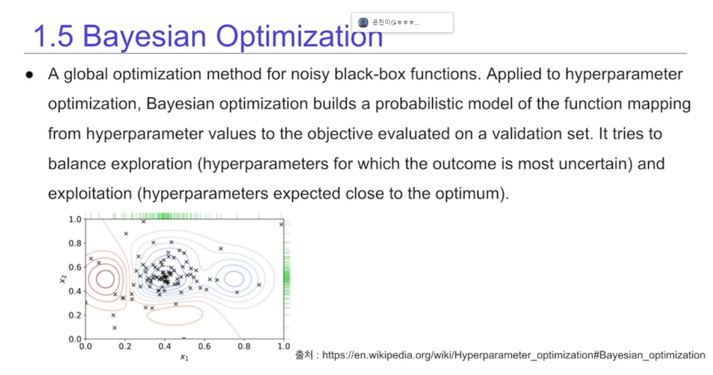
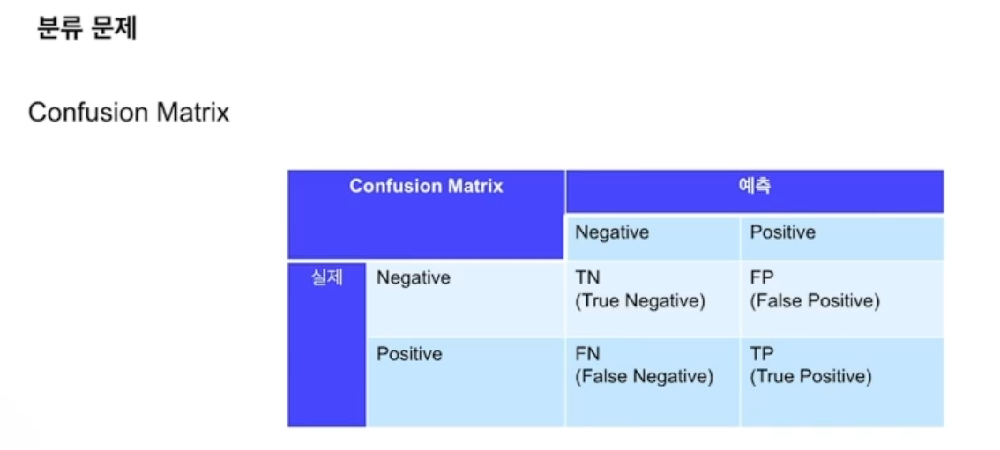
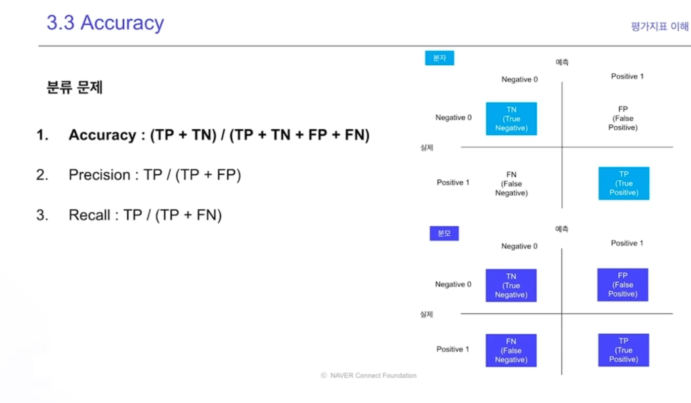
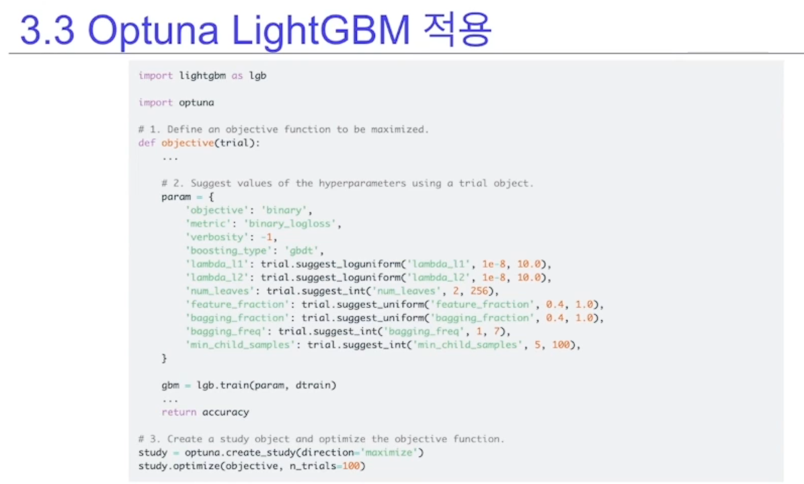

# 정형데이터와 비정형 데이터

## 데이터의 이해

- 데이터를 통해 해결하려는 문제에 대한 고찰

- 문제 정의

타겟 마케팅, 고객 추천

2진 분류 문제

- 가설 -> 실험 -> 검증

Train, Valid, Test

## 머신러닝 평가 지표

1. 분류 회귀 평가지표

- 분류(Classification)

    - 예측해야할 대상의 개수가 정해짐

- 회귀
    - 예측해야할 대상이 연속적인 숫자인 문제

- 평가지표
    - 분류 회귀 머신러닝 문제의 성능을 평가할 지표

### 분류 문제의 평가지표 도표

> Accuracy(암환자 예측같은데 부적합): 불균형한 데이터일 때 부적합함
> Precision(스팸메일 분류): N를 P 잘 못 분류하면 안될때
> Recall(positive가 더 중요한 경우, 악성 종양 분류)

- 0에 가까울수록 예측을 잘 못함

### ROC(reciver operating casting restics) 수신자 조작 특성

- TPR: TP/TP+FN
- 1인 케이스에 대하여 1로 잘 예측한 케이스

- FPR: FP/FP+TN
- 0인 케이스에 대하여 1로 잘못 예측한 케이스

### AUC

