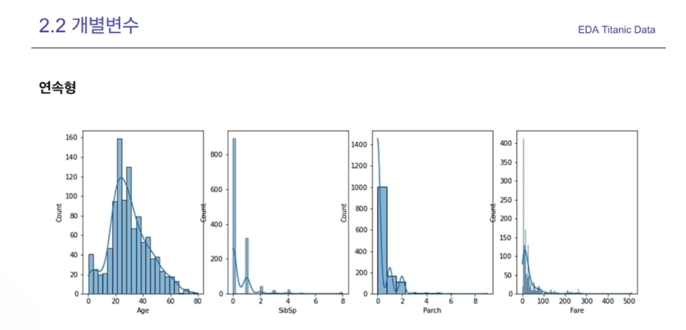

# EDA(탐색적 데이터 분석)

> 데이터를 탐색하고 가설을 세우고 증명하는 과정

- 데이터의 특징을 시각화 통계량으로 표현하는 것

직관적인 이해를 돕는다

비정형, 정형 모든 데이터 분석에 앞서서 이러한 EDA과정을 수반

### EDA 과정

> 데이터를 탐색하고 가설을 세우고 증명하는 반복 과정

1. Data에 대한 가설 혹은 의문

2. 시각화 혹은 통계량, 모델링을 통한 가설 검정

3. 결론을 통해 다시 새로운 가설

데이터 마다 도메인이 상이하고 해결하고자 하는 문제가 다름

두 가지는 항상 확인하는 것이 바람직

> 개별 변수의 분포
>
> 변수간의 분포와 관계

타겟 변수 설정 ex) 타이타닉 생존자

### 연속형 변수

### 범주형 변수

**변수간의 관계**

타겟과 변수를 묶어서 보는 것이 중요하다

