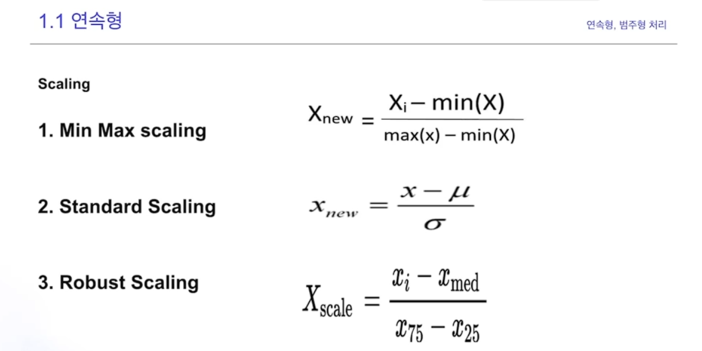
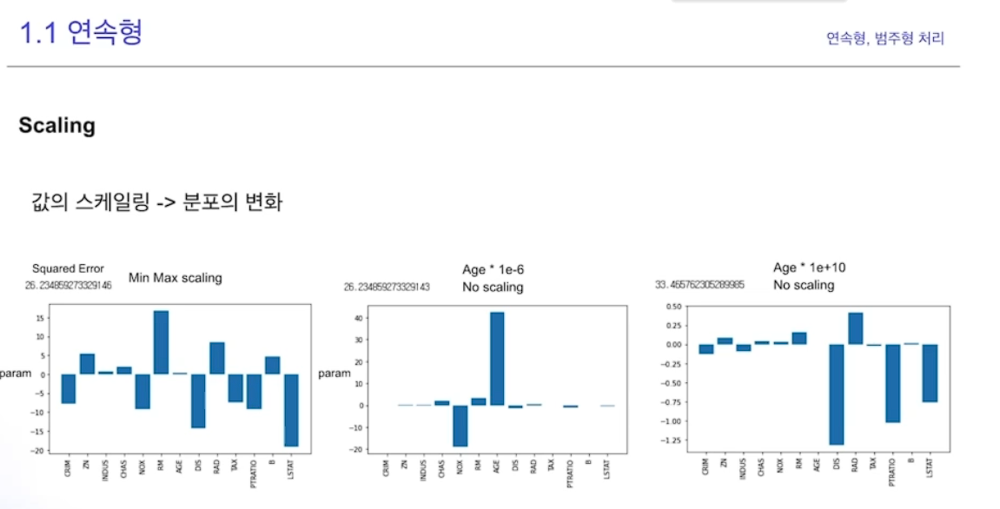
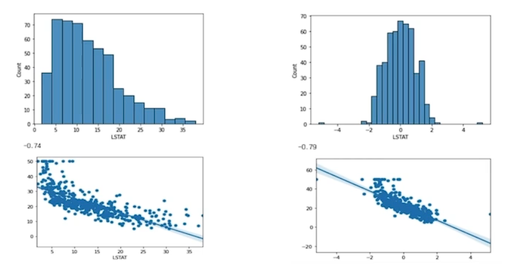
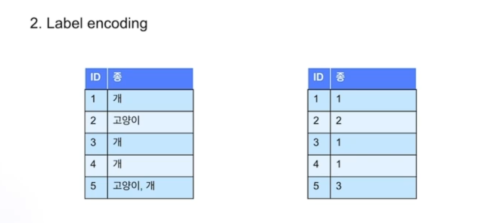
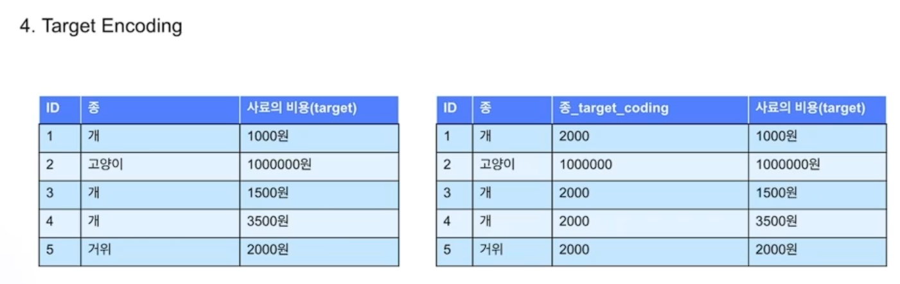
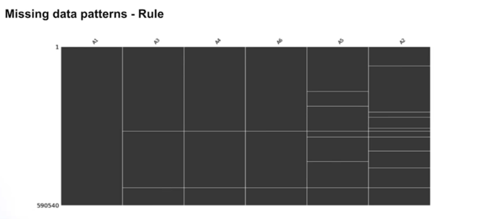
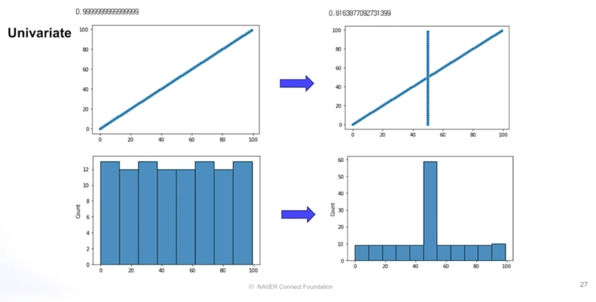
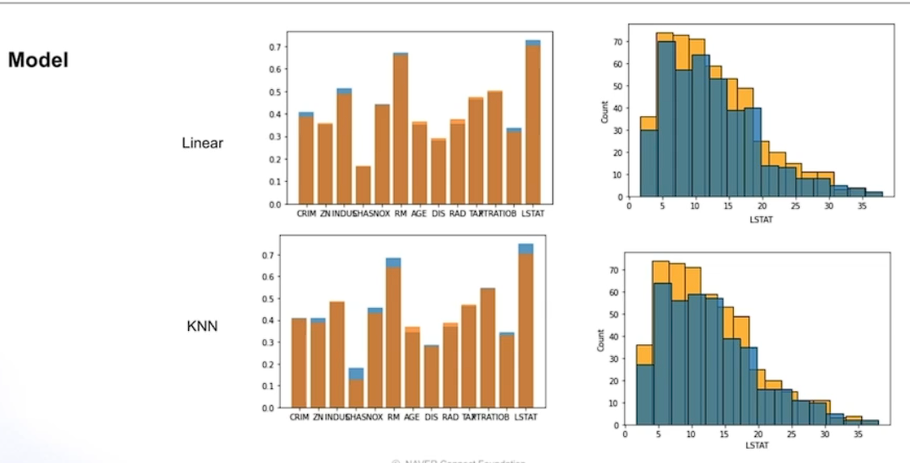
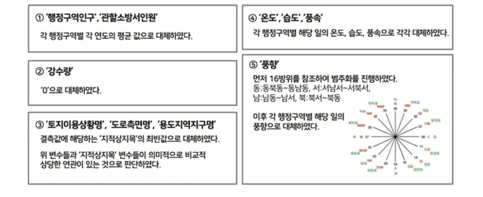

# 데이터 전처리

> EDA에 따라 달라지는 전처리

선형, 트리, 딥러닝

- 연속형, 범주형 처리
- 결측치
- 이상치

## 연속형

### Scaling

데이터의 단위 혹은 분포를 변경

- 선형기반의 모델(선형회귀, 딥러닝 등)인 경우 변수들 간의 스케일을 맞추는 것이 필수적

1. Scale

2. Scale + Distribution 

\+ Binning

스케일링 시에 모델에 영향을 줄 수 있다

Scaling + Distribution

아래 데이터를 보면 오른 쪽이 좀더 직접적인 연관이 있는 것으로 보인다.

Quantile transformation

What we use = Quantile transformation

Binning 연속된 범주를 범주형 변수로 바꾸는 방법

- 넓고 얇은 다봉분포
- Overfitting 방지

## 범주형

### Encoding

1. One Hot encoding

0과 1로 만들기 있으면 1 없으면 0

범주 자체가 너무 많이지면 안 좋음

2. Label encoding

3. Frequency Encoding

값의 빈도수를 측정하는 방법

4. Target Encoding

타겟 변수의 평균을 이용

동일값으로 encoding 되는 문제가 있다

### Embedding

Entity Embedding

## 결측치 처리

### Pattern

비규칙적

규칙적

Missing Data rule

동일한 결측치 확인

### Univariate

1. 제거
    - 데이터수가 줄어드는 문제
    - 해당 변수의 결측치 자체가 크다면 변수 자체를 제거
2. 평균값 삽입
    - 쉬운 방법이지만 결측치가 많을시 주의

3. 중위값 삽입

4. 상수값 삽입

평균값 삽입과 같이 삽입으로 인한 문제가 발생 할 수 있음

결측치 비율

타겟간의 상간관계가 많이 떨어지게 됨

### Multivariate

ML을 통해 결측치를 체울수 있음

위쪽은 선형 모델 아래쪽은 KNN을 통해 결측치를 체움

- 합리적 접근법

## 이상치 처리

이상치 제거시 유사성이 없다는 것을 알수도 있고

몇개의 아웃라이어를 통해서 반대의 경우가 발생할 수도 있다.

### Z-Score

1. 정성적인 측면
    - 이상치 발생 이유
    - 이상치의 의미

2. 성능적인 측면
    - Train Test Distribution

### IQR