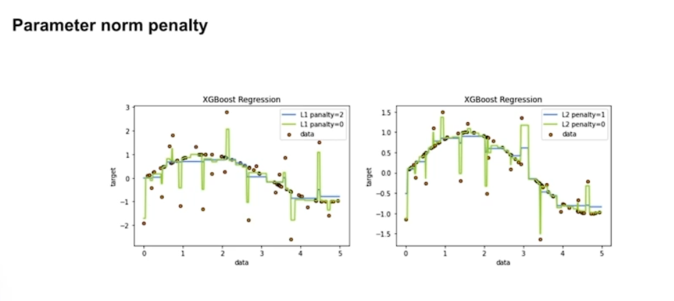
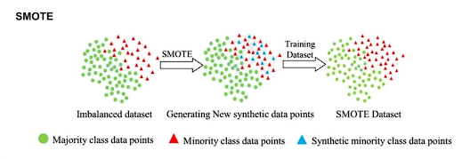
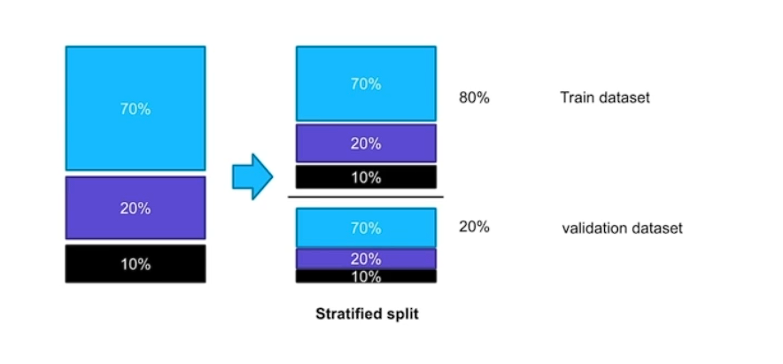
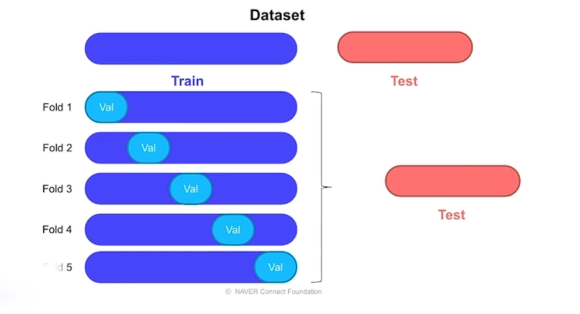
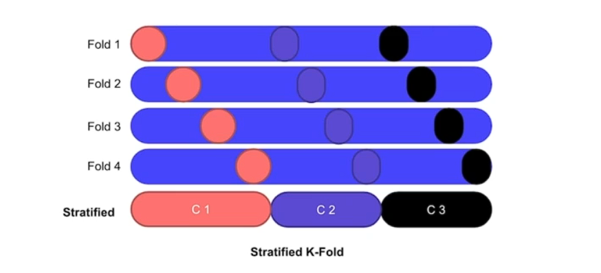
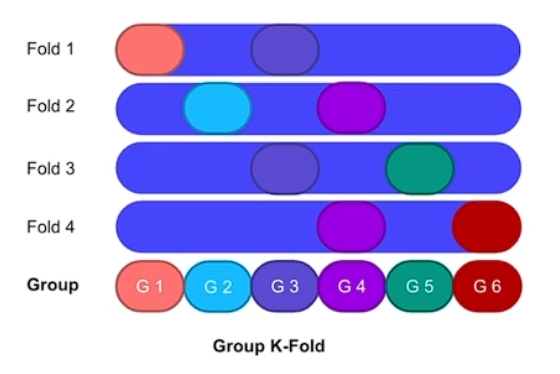
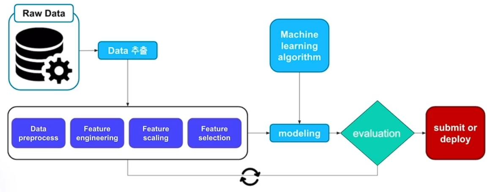

# Underfitting and Overfitting

## Overfittine

### Early stopping

트레이드 오프

### Parameter norm penalty

L1 L2 패널티를 적용한게 overfitting을 방지 할 수 있다.

노이즈에 민감한 

### Data augmentation

의도적으로 데이터의 갯수를 늘리는 방법

이미지 데이터에 경우 회전 플립 등

### SMOTE

모든 데이터를 대상이 아닌 기준 데이터 부터 시작해서 그 근처에 데이터로 확장해 나가는 방식

### Dropout

무작위로 노드의 연결을 끊어버리는 방법

썩은 나무 자라지 못하는 나무를 가지치기하는 것과 유사

## Validation strategy

- Test data set

기준이 되는 데이터셋

전체를 대표할 수 있어야함

프로젝트를 진행할 때 변경하는 것은 바람직하지 않음

- Validation data set

모델에 성능을 파악하는 데이터 셋

Test data set과 최대한 유사하도록 해야함

전체 데이터 셋과 유사할 수 있어야함

- Train data set

Validation data가 정해준 나머지 모든 데이터

노이즈 데이터에 대해서는 고민 해보아야함 3강 이상치 데이터 참고

### Hold-out Validation

### Stratified 

### Cross Validation

여러 쌍의 train validation data set 을 설정하는 방법

이 방법이 K-Fold 방식이라고 한다

기준없이 랜더덤하게 적용

#### Stratified K-Fold

비율로 나눈다 보통 8:2

#### Group K-Fold

구룹이 폴드보다 커야함 겹치면 안됨

### Time series split

시계열 이전 시계열로 다음 시곋열을 예측 가능

### Baseline Stratified K-Fold

## Repeoducobility 재현성

### Fix seed

텐서플로우 같이 시드를 고정

## Machine learning wolkflow

