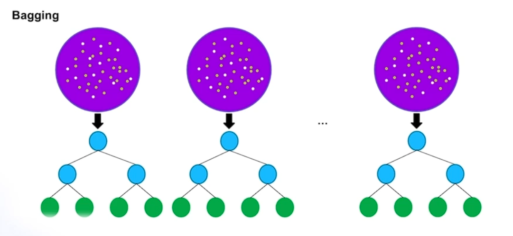

# 트리 모델

## Bagging & Boosting

Random forest = Bagging

디시전 트리를 여러개 이용하여 모델을 만드는 방법

둘에 차이는 train 데이터를 어떻게 다루는지에 대한 차이가 있다.

### Bagging

Bagging = Booststrap + Aggregation

Booststrap:

- Decision Tree

20고개를 한다고 생각하면 좋다

기준에 따라서 모델을 구분하는 모델

- Bagging

병렬 모델 / 다양한 Tree 생성

흰색은 무시

잘 맞추지 못한 데이터에 웨잇을 부여하여

다음 트리에 영향을 준다

### Boosting

순차적 모델 / 정밀한 Tree 생성

> LightGBM / XGBoost / CatBoost

트리가 성장하는 모습을 제안하여 한쪽으로 더욱 성장하도록 하는 방법이 있고 없고에 차이

### Hyper-parameter

사용하는 feature를 랜덤하게 선택하여 데이터가 오버피팅 되는것을 방지한다

이를 row를 기준으로 할 수 도 있다

이렇게 셈플링을 진행하여 새로운 트리를 연속하여 만들 수 있다.

각종 파라미터를 조절할 수 있다.

