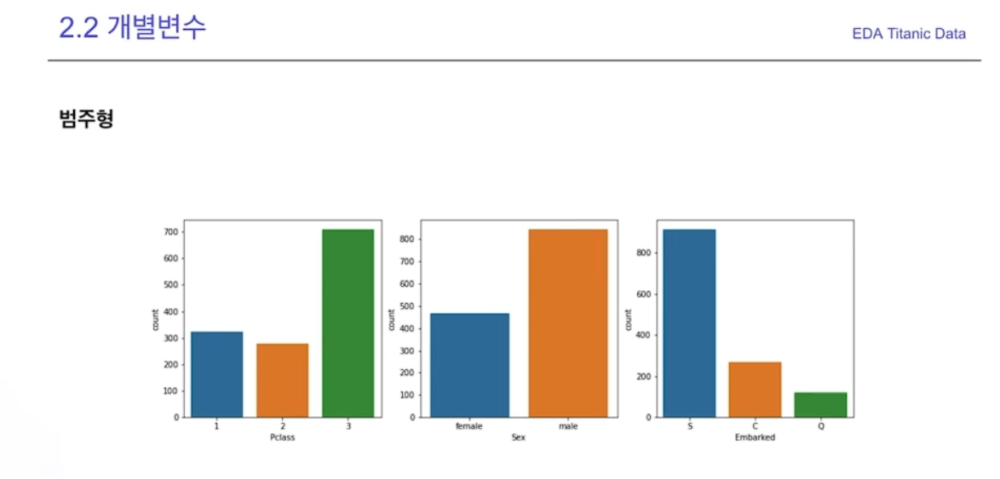
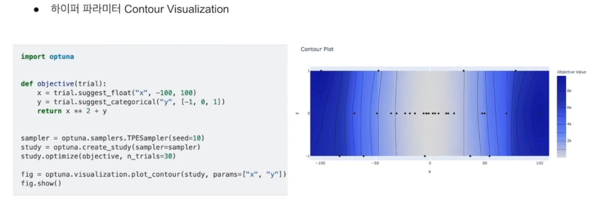
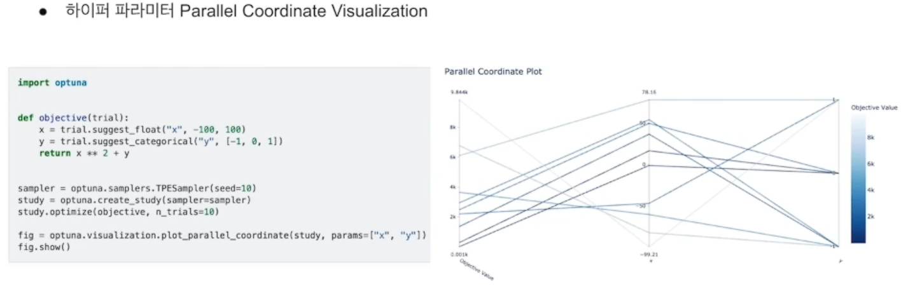

# 하이퍼 파라미터 튜닝

학습전에 사람이 설정해 줘야한다

## 튜닝 방법

- Maual Search
- Grid Search
- Random Search
- Bayesin optimization


### Grid Search

테스트 가능한 모든 테스트 셋을 하나하나 진행하면서 기록하는 것


### random Search

가능한 하이퍼 파라미터 영역에서 랜덤하게 가져옴


실제 그리브 보다 더 좋은 하이퍼 파라미터를 찾아넴

### Bayesian Optimization

최근에 가장 많이 쓰임


##  Boosting Tree 하이퍼 파라미터

종류


## Optuna

오픈소스 하이퍼 파라미터 튜닝 프레임워크

- Eager search spaces

- State-of-the-art algorithms

- Easy parallelization


Sample


```py
import optuna

def objective(trial):
    x = trial.suggest_uniform('x', -10, 10)
    return (x - 2) ** 2

study = optuna.created_study()
study.optimize(objecive, n_trials=100)

study.best_params 
```

LightGBM


Storage 사용가능(Redis, RDB)


visualization



x 따라 모델에 더 큰 영향을 미친걸 알 수 있다


파라미터 별로 목적값과 어떤 관계가 있는지 확인 가능



여러개의 하이퍼 파라미터가 값과 어떤 관계가 있는지

x 0 y 0일때 모델에 성능이 가장 좋았다



Objective value로 부터 시작

