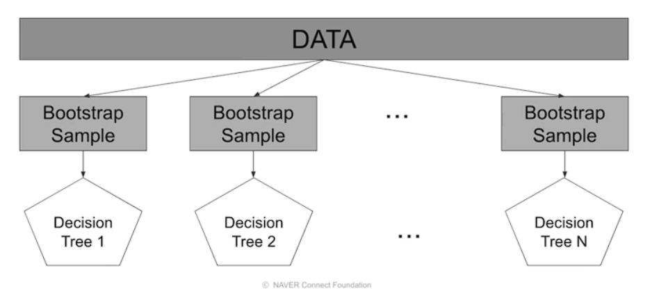
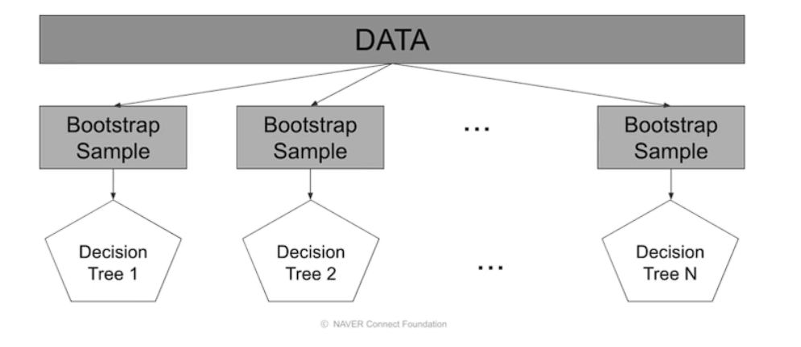
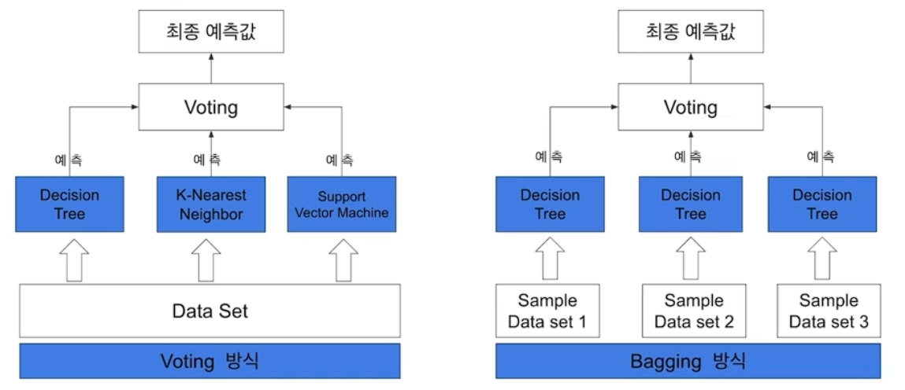
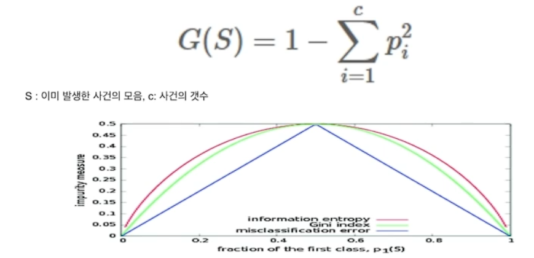
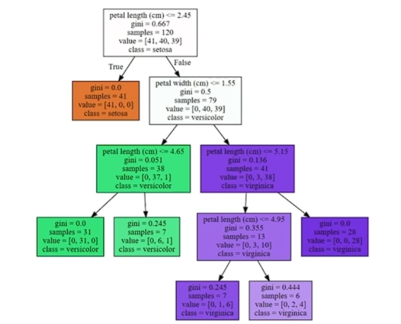
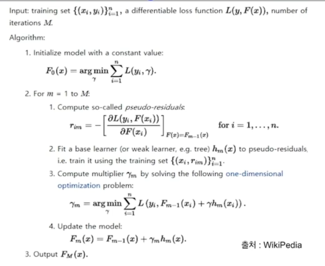
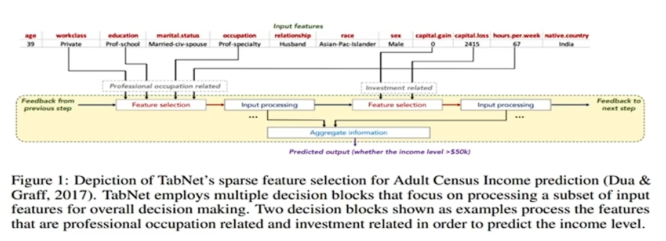

# 앙상블

알고리즘 종류

단일 알고리즘을 적당히 조합하여 단일 알고리즘보다 성능이 향상되는 것을 기대하는 알고리즘 

특정 알고리즘이 모든 데이터 셋에서 항상 좋다고 보장 할 수 없고

특정 데이터 셋에서 성능이 좋은 알고리즘이 다르다

## Ensemble learning

여러 명의 집단지성이 한 사람보다 어려운 문제를 풀기 좋은 이유와 비슷

오버피팅 감소 효과

개별 모델 성능이 잘 안나올 때 효과가 있다

- Bagging

- Voting

- Boosting

- Stacking

### Bagging

데이터 셈플링

중복을 허용 하여 같은 알고리즘과 중복을 허용하여

오버피팅 방지 효과적

### Pasting

중복 X

보통은 Bagging을 많이 사용함

### Voing

알고리즘 모델을 조합

- 하드 보팅: 다수결 원칙

- 소프트 보팅: 평균을 적용

### 보깅 VS 보팅

### Boosting

여러개의 분류기가 순차적으로 학습과 예측을 진행

오버피팅 가능성이 있어 잘 컨트롤 해야함

### Stacking

여러 모델들을 활용해 각각의 예측 결과를 도출한 뒤 그 예측 결과를 결합해서 최종 예측 결과를 만들어 내는 것

오버 피팅에 위험

Cross validation 기반으로 많이 쓰임

굉장히 많은 baseline 모델이 필요하다. 시간이 필요하다

## Tree algorithms

### Decision Tress: Impurity

해당 노드 안에서 섞여 있는 정도가 높을수록 복잡성이 높고, 덜 섞여 있을수록 복잡성이 낮다.

### Gini Index

불순도 측정 지표 데이터 통계적 분산정도 정량화 표현한 값

misclassfication error: 불순도 측정은 가능하나, 미분이 불가능하여 자주 쓰이지는 않는다

### Graphviz

### Gradient Boosting: Pseudo code

### XGboost

### LightGBM

### Catboost

범주형에서 많이 쓰임

## Tab net

논문에서 발표됨

정형데이터를 위한 딥러닝 모델

1. 전처리 과정이 필요하지 않음

2. 정형 데이터에 대해서 기존의 Decision Tree-based gradient boosting(xgboost, lgbm, catboost)와 같은 모델에 비해 신경망 모델은 아직 성능이 안정적이지 못함. 두 구조의 장점을 모두 갖는 신경망 모델

3. Feature selection, interpretability(local, global)가 가능한 신경망 모델, 설명가능한 모델

4. Feature 값을 예측하는 Unsuprevised pretrain 단계를 적용하여 상당한 성능 향상을 보여줌

순차적인 어텐션을 사용하여 각 의사 결정 단계에서 추론한 특징을 선택하여 학습 능력이 가낭 두드러진 특징을 사용

- 기존의 특징 선택과 모델 학습 과정이 나누어 진걸 한번에 가능

- 이로 인해 어떤 특징이 중요한지 설명이 가능하다.

