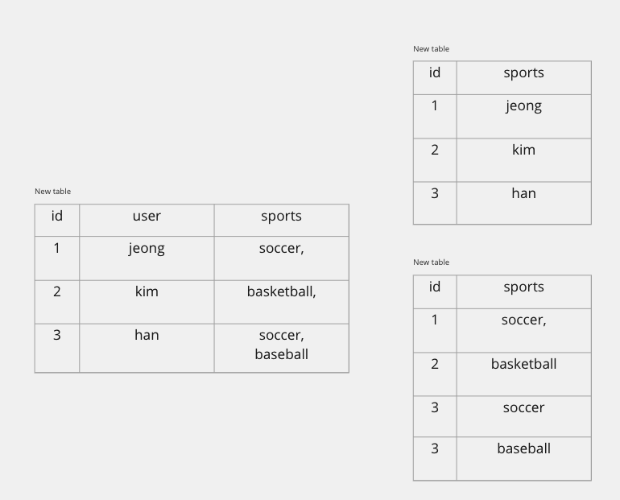
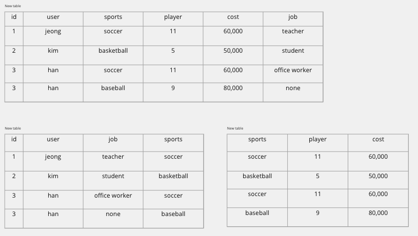
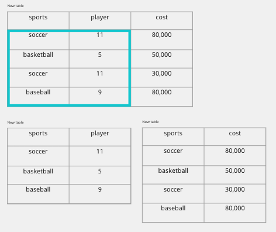

# Normalization 정규화

데이터 베이스에 설계와 깊은 관련이 있다. 정규화는 데이터의 중복방지, 무결성을 충족시키기 위해 데이터베이스를 설계하는 것을 의미합니다.

목적은 갱신 이상을 피하기 위함이다.

**갱신 이상**의 종류

- **삽입 이상(insertion anomalies)** 원하지 않는 자료가 삽입된다든지, 삽입하는데 자료가 부족해 삽입이 되지 않아 발생하는 문제점을 말한다.

- **삭제 이상(deletion anomalies)** 하나의 자료만 삭제하고 싶지만, 그 자료가 포함된 튜플 전체가 삭제됨으로 원하지 않는 정보 손실이 발생하는 문제점을 말한다.

- **수정(갱신)이상(modification anomalies)** 정확하지 않거나 일부의 튜플만 갱신되어 정보가 모호해지거나 일관성이 없어져 정확한 정보 파악이 되지 않는 문제점을 말한다.

## 정규화 과정

DATABASE KEY에 대한 개념을 우선적으로 잘 알아두자

### KEY

- Super key(key) : Attribute의 유일한 식별자, 이때 column하나가 식별자일 수 있고, 여러개를 조합하여 식별자로 사용할 수 있다.

- Candidate Key : Relation 스키마에서 하나 이상의 키가 있다면 One is primary key(PK), others are alternate key

- Prime attribute : 만약 속성이 Relation의 후보키(Candidate Key)들 중 하나라도 종속적이라면 prime attribute이다.

1. **제1 정규화**
   - 테이블의 컬럼이 원자값(Atomic Value, 하나의 값)을 갖도록 테이블을 분해하는 것이다.

2. **제2 정규화**
   - 제1 정규화를 진행한 테이블에 대해 완전 함수 종속을 만족하도록 테이블을 분해하는 것이다. 여기서 완전 함수 종속이라는 것은 기본키의 부분집합이 결정자가 되어선 안된다는 것을 의미한다.
   - 즉, 기본키에 의하여 구분이 가능하지만, 기본키의 일부 만으로도 구분이 가능하면 부분종속 관계를 가지기에 제2 정규화에 어긋납니다.
   - 이를 추출하여 분리하여 새로운 테이블로 만들어 주어야한다.

1. **제3 정규화**
   - 제2 정규화를 진행한 테이블에 대해 이행적 종속을 없애도록 테이블을 분해하는 것이다. 여기서 이행적 종속이라는 것은 A -> B, B -> C가 성립할 때 A -> C가 성립되는 것을 의미한다.
   - 이때 B가 Super Key 이거나 혹은 C가 Prime attribute(후보키의 맴버가 아니면)일 경우에는 만족한다.

1. **BCNF 정규화**
   - 제3 정규화를 진행한 테이블에 대해 X -> A에 대하여 Prime attribute까지 포함하여 고려한다.

