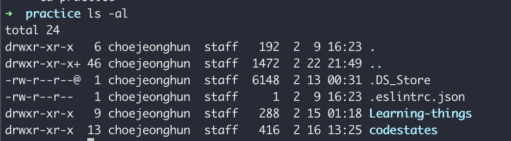

# chmod

기본적인 shell script 커멘드로서 파일의 권한을 설정할 때 사용하는 명령어이다.

기본적으로 shell script 에서는 `ls -al` 을 통해서 파일의 상세 내역을 확인 할 수 있다.



여기서 우리는 각각의 정보를 분류해서 볼 수 있는데 자세한 내용은 따로다뤄 보겠다.

여기서 주목 할 것은 drwxr-xr-x 중 첫 글자를 제외한 나머지 9자는 파일의 권한을 분류하여 나타내어 준다.

9자는 3자씩 각각 분류하여 나타내는 것이 다르다.

- 첫 3자 → User의 권한 "u"
- 4~6자 → Group의 권한 "g"
- 7~9자 → other의 권한 "o"

각각 3문자는 r , w , x 의 순서를 가지고 있다

- r :: read 읽기 권한을 의미
- w :: write 쓰기 권한을 의미
- x :: excute 실행 권한을 의미

실제 쓰임이 많은 명령

```bash
chmod -R filename g+r
chmod -R 755 filename // rwxr-xr-x 가 된다.
```

### 8진법을 이용한 권한 부여

rwx 권한을 8진수로 치환하여 나타낼 수 있다.

rwx/rwx/rwx

421/421/421 

man chmod 참고

chmod  - - file mode or Access control List

```bash
chmod -- file who op perm
```


## chown

파일의 소유권자를 변경하는데 쓰이는 명령어

```bash
chwon 소유자 filename
```