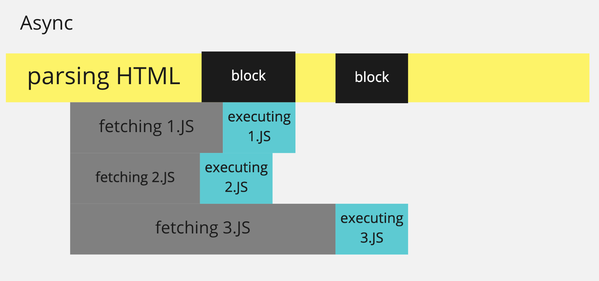
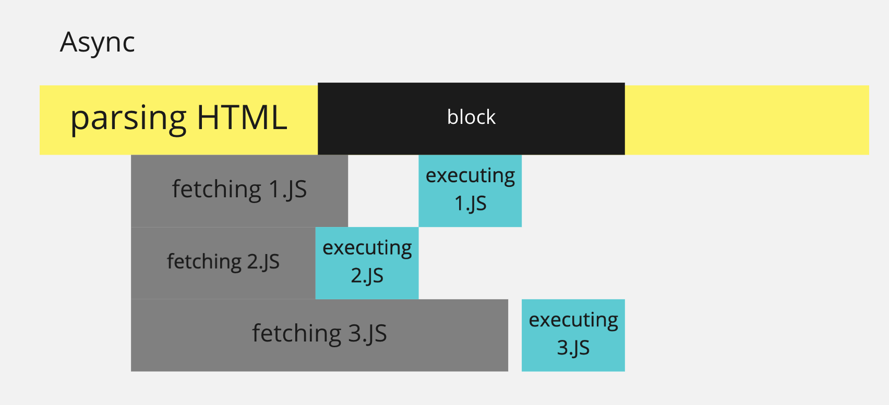

# FETCH 패치해오기

자바스크립트는 외부 api를 이용한 데이터(JSON)를 쓰고 받고할 수 있는 간단한 기능을 제공하여 비동기적인 네트워크 통신을 할 수 있는 기능인 Fetch를 제공한다.

fetch의 예외 케이스를 catch하여 예외 처리하고 데이터를 response받지 않을 수 있다.

```jsx
fetch(apiurl)
.then(response => {
	if(response.ok) {
		return response.json());
	}
	throw new Error('Network response was not ok.');
});
.then(response => {
	return response;
}).catch(e => {
	console.log('There has been a problem :', error.message);
});
```

## Async / defer

### async 비동기적인 실행을 도움

async attribute를 HTML script tag 내에 선언함으로서 script file을 비동기적으로 읽어옴



어떻게 작동하는 것인지 지금으로서는 명확하게 알 수가 없다—-*



### defer

async와 마찬가지로 비동기적으로 실행하지만 HTML parsing이 끝난 뒤에 excutin한다.

스크립트는 HTML에 실행순서에 의하여 execute 순서가 정해진다

