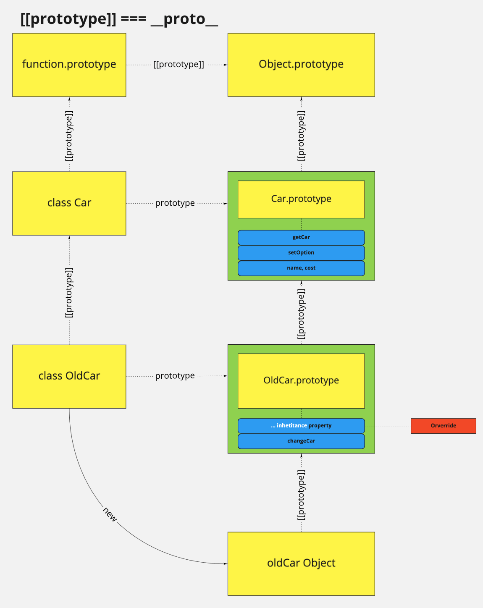
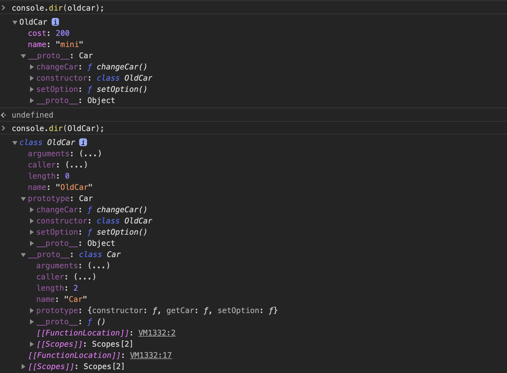

# TIL OOP

- [TIL OOP](#til-oop)
- [오늘의 한 일](#오늘의-한-일)
- [prototype](#prototype)
  - [[[Prototype]] / Prototype property](#prototype--prototype-property)
  - [prototype chain](#prototype-chain)
- [OOP (Object Oriented Programming)](#oop-object-oriented-programming)
  - [Encapsulation (캡슐화)](#encapsulation-캡슐화)
  - [inheritance (상속)](#inheritance-상속)
  - [Abstraction (추상화)](#abstraction-추상화)
  - [Polymorphism (다향성)](#polymorphism-다향성)

# 오늘의 한 일

OOP에 대한 전반적인 지식을 배울 수 있었다

# prototype

자바스크립트의 객체 지향 프로그래밍을 실현할 수 있는 핵심적인 개념이다.

다른 객체지향 프로그래밍 언어들은 객체 생성 이전에 클래스를 정의한다. 하지만 자바스크립트는 class(ES6)의 등장 이전에도 prototype 기반의 특성을 이용하여 객체를 생성하고 이를 instance 처럼 사용할 수 있었다.

ES6 이전에 **생성자 함수**라는 함수를 만들어서 **class** 기능을 대체하였었고, 실제로 class도 함수이니 이 둘은 다를 것이 없다.

## [[Prototype]] / Prototype property

자바 스크립트의 보통 객체(Ordinary Object)는 [[Prototype]]이라는 internal slot을 가진다. 이 값은 null 또는 객체이며 상속을 구현하는데 사용된다. get 액세스를 위해 상속되어 객체의 프로퍼티처럼 사용할 수 있다. 하지만 set 액세스는 허용되지 않는다.

- [[Prototype]]
    - 함수를 포함한 모든 객체가 가지고 있다.
    - 객체의 입장에서 자신의 부모 역활을 하는 프로토타입 객체를 가리키며 함수 객체의 경우 Function.prototype을 가리킨다.

```jsx
console.log(Person.__proto__ === Function.prototype); // true;
```

- prototype
    - 함수 객체만 가지고 있다.
    - 함수 객체가 생성자로 사용될 때 (class도 이에 포함된다) 이 함수를 통해 생성될 객체(instance)의 부모 역활을 하는 객체를 가리킨다.

우리는 이 두가지 개념을 통해

```jsx
Array.prototype.method()
Object.prototype.method()
```

이러한 동작이 어떻게해서 가능한지에 대한 이해를 할수 있다.

실제로 prototype과 cunstructor는 같다고 작용한다.

이렇게 우리는 prototype에 대해 알아보았는데 prototype기반으로 어떻게 객체 지향적인 프로그래밍을 할 수 있는가는 prototype의 chain에 대한 이해가 있어야한다.

## prototype chain

위에서 모든 javascript의 보통 객체는 [[Prototype]]을 가진다고 이야기 하였다. 자바스크립트는 property나 method에 접근할 때 해당 객체에서 찾을 수 없는 경우 [[Prototype]이 가리키는 링크를 따라 부모 객체에서 차례대로 검색한다.

[class](../javascript/11_class.md) 에서 예제를 가져와보자. (상속에 대한 설명을 위한 코드이다)

```jsx
class Car {
  constructor(name, cost) {
    this.name = name;
    this.cost = cost;
  }

  getCar(pay) {
    this.pay = pay;
    return this.pay > this.cost ? true : false;
  }

  setOption () {
    return this.getCar(this.pay) ? this.pay - this.cost > 100 ? "Full Option" : "nomal" : 'isnot your';
  }
}

class OldCar extends Car {

  setOption () {
    return this.getCar(this.pay) ? this.pay - this.cost > 100 ? "Dealer" : "your" : 'isnot your';
  }

	changeCar () {
		return !this.getCar(this.pay) ? "Down grade Car" : "not"
	}
}

const oldcar = new OldCar("mini", 200);

console.log(oldcar.getCar(300)); // true; -- Inheritance
console.log(oldcar.setOption()); // 'your' -- Overrding

// oldcar는 OldCar 클래스의 인스턴스이다.
console.log(oldcar instanceof OldCar); // true
// oldcar는 Car 클래스의 인스턴스이다.
console.log(oldcar instanceof Car);   // true
```

이 코드에서의 prototype chain을 직접 그려보자



실제로 이렇게 만들어진 oldCar 객체와 OldCar class를 console.dir로 찍어보자



# OOP (Object Oriented Programming)

객체 지향적 프로그래밍은 기존의 순차적인 프로그래밍을 데이터의 처리 과정을 보다 다양한 방식으로 수행할 수 있도록 변화하였다. 이로서 데이터와 기능이 별개가 아닌 하나의 묶음으로 처리 될 수 있도록 프로그래밍이 가능하게 되었다.

## Encapsulation (캡슐화)

- 데이터와 기능을 하나의 단위로 묶는 것
- 은닉 (hiding) : 구현을 숨기고, 동작은 노출시킴
- 느슨한 결합 (Loose Coupling)에 유리 : 언제든 구현을 수정할 수 있음
- 이는 코드가 복잡하지 않게 만들어주고, 재사용성을 높입니다.

## inheritance (상속)

[class](../javascript/11_class.md) 여기를 살펴보자

## Abstraction (추상화)

복잡한 과정은 안으로 숨기고 기능적인 부분만 노출할 수 있다.

- 인터페이스의 단순화
- 메소드와 속성만 정의한 것을 인터페이스라 한다.
- 변화에 대한 영향을 최소화 할 수 있다.

## Polymorphism (다향성)

- 하나의 클래스를 통해 같은 기능이 조금씩 다르게 적용되도록 할 수 있다.
- 자동차의 색깔을 바꾼다던지 종류를 바꾼다던지 하는식