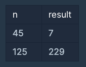

# 3진법

- 생성일: 2021년 2월 7일 오후 9:59
- 태그: 로직의 효율성 검토
- 언어: Javascript

# 문제

자연수 n이 매개변수로 주어집니다. n을 3진법 상에서 앞뒤로 뒤집은 후, 이를 다시 10진법으로 표현한 수를 return 하도록 solution 함수를 완성해주세요.

## 제한사항

## 입출력 예



```jsx
function solution(n) {
    var answer = 0;
    let convertTernary = '';
    
    function reculTernary(n) {
        if (n < 1) {
            return String(convertTernary);
        } else { 
            convertTernary += String(Math.floor(n % 3));
            return reculTernary(n = n / 3);        
        }
    }
    
    return toTenBase(reculTernary(n));;
}

function toTenBase(str) {
    let num = 0;
    let pow = str.length - 1;
    for(let n = 0; n < str.length; n++) {
        num += 3**pow-- * str[n]
    }
    return num;
}
```

## 유의할 점

---

```jsx

```

코드의 비효율 적인 부분을 수정할 수 있을 여지가 많음

메서드없이 풀기 위해서 노력한 부분이 있었지만, 메서드와 arrow function 등을 이용하여 더욱 효율적인 답을 찾을 수 있음