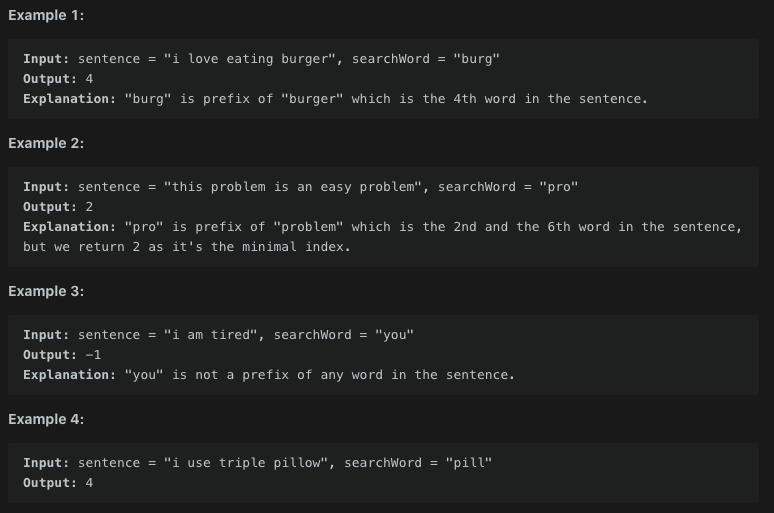

# Check If a Word Occurs As a Prefix of Any Word in a Sentence

- 생성일: 2021년 2월 9일 오후 9:59
- 태그: leetCode
- 언어: Javascript

# 문제

접두어를 찾는 문제로 주어진 문자열안에서  

Given a `sentence` that consists of some words separated by a **single space**, and a `searchWord`.

You have to check if `searchWord` is a prefix of any word in `sentence`.

Return *the index of the word* in `sentence` where `searchWord` is a prefix of this word (**1-indexed**).

If `searchWord` is a prefix of more than one word, return the index of the first word **(minimum index)**. If there is no such word return **-1**.

A **prefix** of a string `S` is any leading contiguous substring of `S`.

## 제한사항

## 입출력 예



```jsx
var isPrefixOfWord = function(sentence, searchWord) {
    //searchWord 모든 문자에 대한 탐색을 해야한다.
    //sentence 의 첫 글자와 일치하는 요소를 sentence에서 검색한뒤
    //각 인덱스를 증가시켜 searchWord와 끝까지 일치하면 그때의
    //white space를 통과한 횟수를 count하여 리턴한다.
    let isPrefix = false;
    let n = 0;
    let count = 1;
    
    for(let i = 0; i < sentence.length; i++) {
        if(sentence[i] === ' ') count++;
        if(searchWord[n] === sentence[i]) {
            if(i === 0 || sentence[i - 1] === ' ') isPrefix = true;
            n++
            if(searchWord.length === n && isPrefix) return count;
        } else {
            n = 0;
            isPrefix = false;
        }
    }
    return -1;
};
```

## 유의할 점

---

```jsx
var isPrefixOfWord = function(sentence, searchWord) {
    //주어진 문자열을 단어단위의 배열로만든다.
    //주어진 배열의 첫글자부터 searchWord와 완벽히 일치하는 index를 찾는다.
    //index에 1을 더하여 리턴한다.
    const words = sentence.split(" ");
    
    for (let i = 0; i < words.length; i++) {
        if(words[i].slice(0, searchWord.length) === searchWord) return i + 1;
    }
    return -1;
};
```