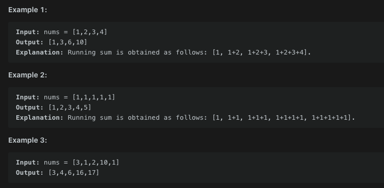

# Running Sum of 1d Array

- 생성일: 2021년 2월 9일 오후 8:23
- 태그: leetCode, 완료
- 언어: Javascript

# 문제

Given an array `nums`. We define a running sum of an array as `runningSum[i] = sum(nums[0]…nums[i])`.

Return the running sum of `nums`.

## 제한사항

## 입출력 예



## 풀이

```jsx
let runningSum = function(nums) {
  //for문으로 nums의 요소를 result 배열에 push한다.
  //임시 저장소에 요소를 저장하고, 
  //다음 요소와 더하여 result 배열에 push한다.
  //끝 까지 반복한다.
  let number = [];
  let temp = 0;
  
  for(let i = 0; i < nums.length; i++) {
      temp += nums[i];
      number.push(temp);
  }
  return number; 
};
```

## 유의할 점

---

```jsx
let runningSum = function(nums) {	
  // nums.slice(0, i) 를 통해 nums 배열을 i길이 만큼의 형태로 만든다.
  // reduce에 해당 slice형태를 넘긴다.
  // return 값을 새로운 arr의 i번째 인덱스에 추가한다.
  let last = nums.reduce(function(acc, vcc) {
    number.push(acc);
    return acc + vcc;
  );
  number.push(last);
  return number;
}
```

reduce의 경우 빅오 표기법에 의해 O(1)의 push과정과 할당 과정이 추가되어 상대적으로 미세하게 느림