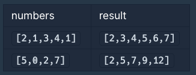

# 두 개 뽑아서 더하기

- 생성일: 2021년 2월 8일 오후 11:14
- 태그: 완료, 프로그래머스
- 언어: Javascript

# 문제

정수 배열 numbers가 주어집니다. numbers에서 서로 다른 인덱스에 있는 두 개의 수를 뽑아 더해서 만들 수 있는 모든 수를 배열에 오름차순으로 담아 return 하도록 solution 함수를 완성해주세요.

## 제한사항

## 입출력 예



최소한의 loop를 통해 이미 시행한 덧셈과 같은 index를 선택하지 못하도록 설정해야 한다.

- 배열에서 index가 다른 두 수를 뽑아서 더하는 작업을 시행한다.
- 두 수의 합을 새로운 배열에 push한다.
- 두 수의 합이 새로운 배열에 이미 존재 한다면 pass 한다.
- 최종적인 배열을 오름차순으로 정렬한다.

```jsx
function solution(numbers) {
    var answer = [];
    numbers.sort((a,b) => a - b)
    for(let i = 0; i < numbers.length - 1; i++) {
        for(let j = i + 1; j < numbers.length; j++) {
            if(!answer.includes(numbers[i] + numbers[j])) {
                answer.push(numbers[i] + numbers[j]);   
            }
        }
    }
    return answer.sort((a,b) => a - b);
}
```

## 복잡도

o(n^2) 복잡도

## 유의할 점 (리펙토링 효율성 검토)

```jsx
function solution(numbers) {
    var answer = [];
    for(let i = 0; i < numbers.length - 1; i++) {
        for(let j = i + 1; j < numbers.length; j++) {
            if(!answer.includes(numbers[i] + numbers[j])) {
                answer.push(numbers[i] + numbers[j]);   
            }
        }
    }
    return answer.sort((a,b) => a - b);
}
```