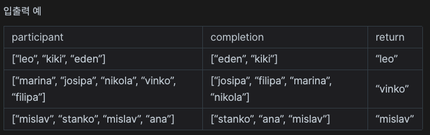

# 완주하지 못한 선수

- 생성일: 2021년 2월 9일 오후 8:31
- 태그: 완료, 프로그래머스
- 언어: Javascript

# 문제

수많은 마라톤 선수들이 마라톤에 참여하였습니다. 단 한 명의 선수를 제외하고는 모든 선수가 마라톤을 완주하였습니다.

마라톤에 참여한 선수들의 이름이 담긴 배열 participant와 완주한 선수들의 이름이 담긴 배열 completion이 주어질 때, 완주하지 못한 선수의 이름을 return 하도록 solution 함수를 작성해주세요.

## 제한사항

- 마라톤 경기에 참여한 선수의 수는 1명 이상 100,000명 이하입니다.
- completion의 길이는 participant의 길이보다 1 작습니다.
- 참가자의 이름은 1개 이상 20개 이하의 알파벳 소문자로 이루어져 있습니다.
- 참가자 중에는 동명이인이 있을 수 있습니다.

## 입출력 예



```jsx
function solution(participant, completion) {
		// 입력 받은 두 배열을 정렬하여 같은 순서로 배치한다.
		// for 문중에 중간에 다른 값이 나오는 index에서 명단을 리턴한다.
    participant.sort()
    completion.sort()
    console.log(completion, participant);
    for(let i = 0; i < participant.length; i++) {
        if(participant[i] !== completion[i]) {
            return participant[i]
        }
    }
}
```

## 유의할 점

---

```jsx

```