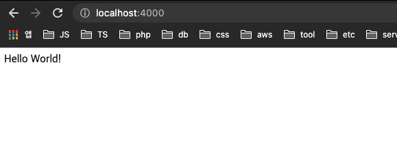

# DevServer 배포 자동화

우선 Dev서버의 필요성을 느끼고 *Dev서버*를 구성하기로 하였다.

기본적인 **요구조건**은 다음과 같다

- **Production 환경과 같은 환경**에서 운영될 것
- **Mock Server**로서 활용할 수 있을 것
- **CI/CD**에 의하여 소스코드메니저에 의한 자동 배포가 이루어 질 것
- Dev Server를 **로컬 환경에서도 실행** 할 수 있도록 Docker hub에 구성할 것

이렇게 4가지의 과제를 해결하기 위하여 여러가지 방법을 생각해고 시도해본 **시행착오를** 적어보도록 하겠다

## Docker로 서버 코드 말아보기

우선은 모든것의 시작은 도커를 이용하여 `Node`서버를 구성하여 올려 보도록 하자
`docker`는 우선 `images`를 만들어 해당 이미지를 `Container`로 띄워서 가상 머신을 별다른 세팅없이 가상머신을 돌릴수 있도록 돕는 오픈소스 라이브러리 이다.

도커를 설치하는 것은 [공식 홈페이지를 참조](https://docs.docker.com/engine/install/)하도록 하자.
*공홈에서 GitHub Action과 함께 사용하는 [가이드 영상](https://youtu.be/iqqDU2crIEQ)을 제공해준다

도커 설치가 끝났으면이제 구성된 서버를 이미지화 해보자.

1. **Create `Dockerfile`**

Docker는 `Dockerfile`에 의하여 이미지를 구성한다.

> *Dockerfile*에 대한 자세한 내용은 공식 홈페이지를 참조하자. https://docs.docker.com/engine/reference/builder/

참고로 본 포스팅에서 구성한 서버는 `nestjs`. 즉, `node`환경을 기반으로 구성되어 있다.

node용 도커파일의 [best practice](https://github.com/nodejs/docker-node/blob/main/docs/BestPractices.md)를 `node-docker`에서 제공하고 있으니 참고해서 작성하면 되겠다.

자신의 프로젝트에 맞게끔 `Dockerfile`을 작성하자.

```
# Dockerfile
FROM node:16-alpine As development

WORKDIR /home/node/app

COPY package*.json ./

RUN npm install

COPY . /home/node/app

RUN npm run build

FROM node:16 as production

ARG NODE_ENV=production
ENV NODE_ENV=${NODE_ENV}

WORKDIR /

COPY package*.json ./

RUN npm install --production

COPY --from=development /home/node/app/dist /dist

EXPOSE 4000

CMD [ "node", "/dist/main.js"] 
```

1. **Docker build**

```bash
$ Docker build -t images-tag .

docker build [OPTIONS] PATH # 여기서의 PATH는 Dokerfil의 위치를 지정해 주는 것이다.
```

```sh
[+] Building 16.6s (17/17) FINISHED                                                            
 => [internal] load build definition from Dockerfile                                      0.0s
 => => transferring dockerfile: 410B                                                      0.0s
 => [internal] load .dockerignore                                                         0.0s
 => => transferring context: 34B                                                          0.0s
 => [internal] load metadata for docker.io/library/node:16                                2.4s
 => [internal] load metadata for docker.io/library/node:16-alpine                         2.4s
 => [auth] library/node:pull token for registry-1.docker.io                               0.0s
 => [production 1/5] FROM docker.io/library/node:16@sha256:683b8ea4ebc033a0f9060501fc31c  0.0s
 => [development 1/6] FROM docker.io/library/node:16-alpine@sha256:8f1827381eb7fca5a79ad  0.0s
 => [internal] load build context                                                         0.1s
 => => transferring context: 30.90kB                                                      0.0s
 => CACHED [development 2/6] WORKDIR /home/node/app                                       0.0s
 => CACHED [development 3/6] COPY package*.json ./                                        0.0s
 => CACHED [development 4/6] RUN npm install                                              0.0s
 => [development 5/6] COPY . /home/node/app                                               0.1s
 => [development 6/6] RUN npm run build                                                  13.4s
 => CACHED [production 2/5] COPY package*.json ./                                         0.0s 
 => CACHED [production 3/5] RUN npm install                                               0.0s 
 => CACHED [production 4/5] COPY --from=development /home/node/app/dist /dist             0.0s 
 => exporting to image                                                                    0.0s 
 => => exporting layers                                                                   0.0s
 => => writing image sha256:1ab4c88fc43519a071a1e1b3b3d4c26bd77c53eb17f675102904451f05d7  0.0s
 => => naming to docker.io/library/images-tag:test                                         0.0s
 ```

Dockerfile이 실행되면서 Docker imge를 생성하는 과정을 로그로 확인할 수 있다.

3. **Container 띄우기**

이제 만들어진 이미지를 확인하고 컨테이너로 띄워보자.

```bash
$ docker images

REPOSITORY   TAG       IMAGE ID       CREATED          SIZE
images-tag   latest    0ba9d8d1a439   24 minutes ago   984MB
```

build된 이미지 repo list를 확인할 수 있다.

`Container`는 이러한 이미지를 `Docker run` 명령을 통해 실행 시키는 것으로 Container를 실행시킬 수 있다.

```bash
$ docker run -d -p 4000:4000 --rm --name <Container_name> <image:tag or image ID>
```

위의 자세한 Option은 `docker run --help`를 통해알아보자.

하지만 위의 옵션은 Container를 실행해보고 테스트하기에 적절하니 기억해두면 좋다.

- `-p`: `<Container port>:<Host port>`가 되겠다. 즉 앞의 포트는 도커가 열리는 포트, 뒤에 포트는 내가 작성한 코드에서 여는 포트가 되겠다.
- `-d`: detach. 백그라운드에서 실행시킨다.
- `--rm`: Container **종료와 동시에 삭제한다** 이게 생각보다 유용하다.
- `--name`: 이름을 정해준다. 안정하면 이름이 임의로 생성된다.

이렇게 Container를 실행하면 `docker ps`를 통해 **실행중인** Container를 조회할 수 있다.

```bash
$ docker ps

CONTAINER ID   IMAGE               COMMAND                  CREATED          STATUS          PORTS      NAMES
b2b3638cb8c6   images-tag:latest   "docker-entrypoint.s…"   26 seconds ago   Up 25 seconds   4000/tcp   test_container
```

그다음에 열어둔 포트를 `http://localhost:4000`아와 같이 접속하면 페이지를 잘 확인할 수 있어야한다.




처음으로 올린 **Docker Container**가 완성되었다.

4. **Docker hub 이용해서 image 공유하기**

> 이 부분은 Docker hub에 대한 이해를 돕는 부분이다.

**Docker hub계정이 있고 이미 사용경험이 있다면 과감히 건너뛰는 것을 권장한다.**

- 우선 Docker hub를 이용하기 위해 *Docker hub 계정을 만들고 로그인해보자*

  그럼 아래와 유사한 화면(~~이미 저는 테스트해본 Repo가 있는 상태입니다~~)

  

- 이렇게 자신의 **docker hub**에 잘 들어가 졌다면이제 image를 Push 해보자

  ```bash
  $ docker push <Username>/<image>:<image-tag>
  ```

  하지만 이렇게 해보면 이미지를 찾을 수 없다고 한다...

  Push 할때 **Username까지 포함한 image를 local에 생성한 뒤**에 Push해야 하기 때문이다.

  ```bash
  $ docker tag <image>:<image-tag> <Username>/<image>:<image-tag>
  ```
  이다음에 푸시를 위에 실행했던 Push를 실행해보면 잘 수행되는 것을 볼 수 있다.

  이렇게 `image`를 밀어넣어주면 **Docker hub에 저처럼 리스트가 생성**됐을 겁니다.


- 이제 어디서든 **docker hub에서 image를 pull 받아와서 실행할** 수 있다.

  그 전에 우선 local에 생성한 image를 삭제하고 당겨와서 테스트를 해보자

  ```bash
  $ docker images

  REPOSITORY            TAG       IMAGE ID       CREATED          SIZE
  images-tag            latest    0ba9d8d1a439   24 minutes ago   984MB
  Username/images-tag   latest    41dd421a452f   4 minutes ago    984MB
  ```

  ```bash 
  $ docker rmi <Username>/<image>:<image-tag>
  ```

  ```bash
  $ docker images

  REPOSITORY   TAG       IMAGE ID       CREATED          SIZE
  images-tag   latest    0ba9d8d1a439   24 minutes ago   984MB
  ```

  깔끔히 삭제가 이루어졌다면 이제 Pull을 당겨와서 Container를 실행시켜보자

  ```bash
  $ docker pull <Username>/<image>:<image-tag>

  $ docker images

  REPOSITORY            TAG       IMAGE ID       CREATED          SIZE
  images-tag            latest    0ba9d8d1a439   24 minutes ago   984MB
  Username/images-tag   latest    41dd421a452f   1 minutes ago    984MB
  ```

  이렇게 당겨온 image를 run을 통해 실행하면 local에서 만들었던 Container와 똑같이 동작하는 것을 볼 수 있다.

## Docker Github Action으로 배포하기 

이제 `Docker`와 `Docker hub`에 대하여 알아보았으니 이를 CI/CD를 입혀보자.

- CircleCI
- gitlab
- bamboo
- github
- etc

다양한 CI/CD 서비스에서 docker hub에 이미지를 올려 배포할 수 있으나

본 포스팅에서는 **`Github action`을** 이용하도록 하겠다.

> Git Action은 크게 2단계로 나누어 구성하도록 하였다
> 1단계는 Pull Request때 테스트 자동화를 위한 Codecov를 이용한 testReport와
> docker hub에 버전을 만들어 자동으로 push를 진행하고
> 2단계는 Push(merge)때 만들어진 latest 버전의 도커 Image를 배포하도록 구성하는 방법을 알아보자

1. **Git Action을 통한 test 자동화와 Docker hub 구성하기**

  우선 Git Action으로 가서 `New workflow`를 통해 새로운 일거리(job)을 만들어주자

  

  ```yml
  # This is a basic workflow to help you get started with Actions

  name: CI to Docker hub

  # Controls when the workflow will run
  on:
    # PR이 들어오면 실행된다.
    pull_request:
      branches: [master]

  # 소일거리를 주자
  jobs:
    test:
      # 운영체제를 선택한다.
      runs-on: ubuntu-latest

      steps:
        #현재 PR이 되는 Branch로 체크아웃한다.
        - name: Check Out Repo
          uses: actions/checkout@v2

        #node를 설치한다
        - uses: actions/setup-node@v2
          with:
            node-version: '16'

        - name: install node package
          run: npm install
        - name: run test
          run: npm run test

        # codecov를 action에서 실행해서 report를 남기도록 한다.
        - name: Codecov
          uses: codecov/codecov-action@v2
          with:
            token: ${{ secrets.CODECOV_TOKEN }}
            flags: unittests

    build:
      runs-on: ubuntu-latest

      steps:
        - name: Check Out Repo
          uses: actions/checkout@v2

        # docker hub에 접근할 수 있는 토큰을 이용하여 Docker hub에 접근한다.
        - name: Login to Docker Hub
          uses: docker/login-action@v1
          with:
            username: ${{ secrets.DOCKER_HUB_USERNAME }}
            password: ${{ secrets.DOCKER_HUB_ACCESS_TOKEN }}

        # 요부분은 Docker에서 지원하는 Plugin을 살펴보자
        - name: Set up Docker Buildx
          id: buildx
          uses: docker/setup-buildx-action@v1

        - name: Build and push
          id: docker_build
          uses: docker/build-push-action@v2
          with:
            context: ./
            file: ./Dockerfile
            push: true
            #docker hub에 Username과 event number를 통해서 버전관리를 해주자.
            tags: ${{ secrets.DOCKER_HUB_USERNAME }}/images-tag:${{ github.event.number }},${{ secrets.DOCKER_HUB_USERNAME }}/images-tag:latest

        - name: Image digest
          run: echo ${{ steps.docker_build.outputs.digest }}
  ```

  *대부분 주석으로 설명을 붙였지만 Secret은 본인의 git repo setting에서 직접 해당 Key: value를 설정해 줘야하니 참고하자

  이렇게 해두면 PR이 들어오는 것과 동시에 Github Action이 실행되고, 

  TEST와 build를 실행한다.

2. 이제는 배포의 차례이다.

  배포의 단계는 2단계로 나뉜다.

  scp를 통해서 `Docker-compose.yml` Workdir로 복사해가기(Docker-compose에 대해서는 아래에서 더 자세히 설명하니 우선 넘어가자)

  ssh-action을 통해서 지정한 shell script를 실행하자.

  간단히 Yml만 확인해보고 Docker-compose에 대하여 알아보자.

  ```yml
  build:
    # The type of runner that the job will run on
    runs-on: ubuntu-latest

    steps:
      # 하위 작업에서 Docker-compose.yml 파일을 복사해오도록 하자.
      - uses: actions/checkout@master
      - name: copy docker-compose via ssh password
        uses: appleboy/scp-action@master
        with:
          host: ${{ secrets.HOST }}
          username: ${{ secrets.USERNAME }}
          key: ${{ secrets.SSHKEY }}
          source: './docker-compose.yml'
          target: '.'

      # 하위 작없에서 nginx config를 복사해오도록 해주었다.(Optional)
      - uses: actions/checkout@master
      - name: copy docker-compose via ssh password
        uses: appleboy/scp-action@master
        with:
          host: ${{ secrets.HOST }}
          username: ${{ secrets.USERNAME }}
          key: ${{ secrets.SSHKEY }}
          source: './templates/*'
          target: './templates/'

      # Dokcer compose 커멘드라인을 이용해서 
      - name: executing remote ssh commands using password
        uses: appleboy/ssh-action@master
        with:
          host: ${{ secrets.HOST }}
          username: ${{ secrets.USERNAME }}
          key: ${{ secrets.SSHKEY }}
          script: |
            docker pull ${{ secrets.DOCKER_HUB_USERNAME }}/images-tag:latest
            docker-compose down
            docker-compose up -d
  ```
  
## Docker-compose

여기서 Docker-compose에 대해서 자세히 다뤄보자.

**`Compose`는 다중 컨테이너 Docker 애플리케이션을 정의하고 실행하기 위한 도구이다.**
 `.yml`확장자를 이용하여 **YAML 파일을 사용하여 어플리케이션 서비스를 구성**할 수 있다.

Docker compose가 제공하는 효과적인 기능에 대하여 알아보자

 - ****
 - **컨테이너 생성 시 볼륨 데이터 보존**
 - **변경된 Container만 재셍성**
 - **환경 간의 변수와 컴포지션 이동**

 1. **단일 호스트에서 여러 개의 격리된 환경 구성**

    `Compose`는 프로젝트 이름을 사용하여 환경을 서로 독립적으로 실행한다. 여러 다른 Context에서 이프로젝트 이름을 사용할 수 잇다. **예를 들어보자**

    - Dev Host에서 프로젝트의 각 기능 분기에 대해 안정적인 복사본을 실행하려는 경우처럼 하나의 환경의 여러 복사본을 만들기 위해사용할 수 있다.
    - CI Server 환경에서 빌드가 서로 간섭하지 않도록 하려면 프로젝트 이름을 고유한 빌드 번호로 설정할 수 있다.
    - 공유 Host 또는 Dev Host 환경에서 동일한 서비스 이름을 사용할 수 있는 다른 프로젝트가 서로 간섭하는 것을 방지

2. 컨테이너 생성 시 볼륨 데이터 보존
   
   `Compose`는 서비스에서 사용하는 모든 볼륨을 보존한다. `docker-compose up`이 실행될 때 **이전 실행에서 컨텡너를 찾으면 이전 컨테이너에서 새 컨테이너로 볼륨을 복사**합니다.
   
   이 프로세스는 볼륨에서 생성한 모든 데이터가 손실되지 않도록 합니다.

3. 변경된 Container만 재생성

   `Compose`는 컨테이너를 만드는 데 사용된 구성을 캐싱한다. 변경되지 않은 서비스는 다시 시작할 때 기존의 컨테이너를 재사용한다. 우린 덕분에 **빠르게 환경을 구성하고 변경할 수 있다.**

4. 환경 간의 변수와 컴포지션 이동
  
   `Compose`는 `Compose 파일의 변수를 지원한다. 이러한 변수를 사용함으로서 **다양한 환경 또는 다른 사용자에맞는 구성을 사용자가 지정할 수 있다.**

위 내용을 간단히 이해 한다면 어떤때에 `Compose`를 구성하면 좋을지 전략을 세울수 있다.

본론으로 들어가서 **컴포저 구성**은 어떻게 하였는지 함께 살펴보자

Compose 파일에서는 **Service, NetWork, Volume**을 정의한다.

파일 명세의 자세한 내용은 워낙에 방대하니 따로 다루지 않겠다.*[자세한 내용은 홈페이지를 참고](https://docs.docker.com/compose/compose-file/compose-file-v3/)

```yml
version: '3'

services:
  devserver:
    image: USER_NAME/IMAGE_NAME:TAG
    container_name: devserver
    build:
      context: .
      dockerfile: Dockerfile
    volumes:
      - .:/code
      - /code/node_modules
    networks:
      - app-network
    ports:
      - 4000:4000

  web:
    image: nginx:mainline-alpine
    container_name: nginx
    restart: on-failure:30
    tty: true
    volumes:
      - ./templates:/etc/nginx/conf.d
    ports:
      - '80:80'
    networks:
      - app-network
    depends_on:
      - devserver

networks:
  app-network:
    driver: bridge
```

이렇게 만들어둔 `docker-compose.yml`을 scp를 통하여 복사하고, 복사한 Compose를 `docker-compose up`을 통하여 실행한 것이다.

현재 작성자의 환경은 Digitalocean에 Droplet을 이용한 DevServer환경임을 참고하자.

AWS라면 NGiNX 없이 구성할 수 있지만 이런 경우에는 권한과 key관리 문제가 있을수 있으니 참고하자.

이상으로 Docker - github action - digitaloean - nginx 를 적절히 사용하여 배포하는 node 환경 서버에 대하여 알아보았다.