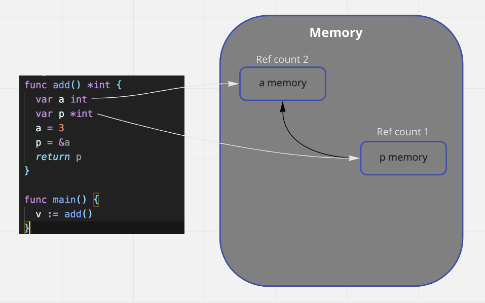

# Garbage_Collector

go에서의 가비지 콜렉터

쓸모가 없어지면 쓰레기로 취급하여 삭제한다.

기본적으로 block 스코프내에서 작동하는 변수의 경우 block이 끊어지면 garbage로 취급한다.

이때 혹시 모를 버그의 발생을 방지하기 위해 Refrence Count를 확인한다

Refrence count == 0 이면서, block이 벗어아면 garbage_collector가 자동으로 메모리를 회수한다.

C언어에서 발생하는 댕글링 같이 빈 메모리를 참조하는 에러를 방지할 수 있다.

```go
func add() *int {
  var a int
  var p *int
  a = 3
  p = &a
  return p
}

func main() {
  v := add()
}
```



### 가비지 컬렉터는 레퍼런스 카운트와 함수의 끝나는 구문을 확인한다.


### a memory는 여전히 v라는 변수에서 refrence하고 있기 때문에 메모리에 남는다.

참조 카운트가 변화할때 가비지 컬렉터가 작동한다.

혹은 **외딴섬** 돌아돌아 자기 자신을 참조하여 전체적으로 사용되지 않는 메모리를 삭제해주기도 한다.

