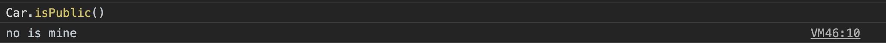

# class

- [class](#class)
  - [1.1. class란?](#11-class란)
  - [1.2. instance](#12-instance)
  - [1.3. constructor](#13-constructor)
    - [1.3.1. 클래스 필드](#131-클래스-필드)
    - [1.3.2. static](#132-static)
- [2. getter && setter](#2-getter--setter)
  - [2.1. getter](#21-getter)
- [3. 상속 (Inheritance)](#3-상속-inheritance)
  - [3.1. extends](#31-extends)
  - [3.2. super](#32-super)

ES6에 들어서서 완벽한 객체 지향 프로그래밍이 되기 위해 등장하였다. 자바스크립트는 강력한prototype 기반 객체지향 프로그래밍 능력을 가지지만 갑을논박이 많았지만 class의 등장으로 생성자 함수를 통해 돌아가던 자바스크립트 환경을 조금더 객체지향 프로그래밍으로 인정 받을 수 있게 만들어 주었다.

## 1.1. class란?

객체를 찍어낼 수 있는 청사진(blueprint) class를 이용해서 객체를 만들어낼 수 있고, 이렇게 만들어진 객체를 instance라고 칭한다.

```js
class Person {
  constructor(name) {
    this._name = name;
  }

  sayHello() {
    console.log(`Hello! ${this._name}`);
  }
}

const me = new Person("Lee");
me.sayHello(); // Hello! Lee

console.log(me instanceof Person); // true
```

// construct는 class객체에 반드시 있고 명시하지 않을시 빈 객체를 만들어 낸다.

## 1.2. instance

class를 통해 prototype-base의 객체를 할당 할 수 있다.

이때 new라는 연산자와 함꼐 클래스 이름을 호출하면 클래스 인스턴스 즉 객체가 생성된다.

```js
class Foo {}

const foo = new Foo();
```

new 연산자를 사용하지 않으면 Typeerror가 발생한다.

new는 instance 키워드이다. 각각의 인스턴스는 class의 내장 함수인 mthod에 접근할 수 있다.

```js
class Foo {}

const foo = Foo(); // TypeError: Class constructor Foo cannot be invoked without 'new'
```

## 1.3. constructor

class는 생성자를 필요로하는데, 이 생성자가 constructor 이다.

인스턴스를 생성하고, \*클래스 필드를 초기화하는 특수한 method

### 1.3.1. 클래스 필드

클래스 내부의 캡슐화된 변수, 즉 `this`에 추가한 property

```js
// 클래스 선언문
class Car {
  // constructor(생성자). 이름을 바꿀 수 없다.
  constructor(model) {
    // _model은 클래스 필드이다.
    this.model = model;
  }
}
```

constructor는 외부에서 언제다 접근하여 값을 수정할 수 있는 특징이 있다.(public) 2020/02 현재는 # 를 이용해서 publicField와 privateField를 구분 할 수 있다

```js
class Foo {
  constructor(name = '', gender) {
    this.name = name; // public 클래스 필드
		#this.gender = gender;
  }
}

const foo = new Foo('Lee');
console.log(foo.name); // 클래스 외부에서 참조할 수 있다.
console.log(foo.gender); // undefined
```

### 1.3.2. static

instance 와는 별개로 클래스에서 자주 사용하는 method 혹은 value에 접근하고자 할 때

즉, instance를 생성하지 않고 접근할 수 있도록 해준다.

```js
class Car {
  static public = "no is mine";
  constructor(name, model, owner) {
    this._name = name;
    this._model = model;
    this._owner = owner;
  }

  static isPublic() {
    console.log(Car.public);
  }
}
```



# 2. getter && setter

## 2.1. getter

getter는 이름 그대로 무언가를 취득할 때 사용하므로 반드시 무언가를 반환해야 한다

getter는 prototype에 메소드로 사용되어 지는데 이때 메소드의 이름은 클래스 필드 이름처럼 사용된다.

그럼 의문점이 생긴다 아래 코드를 보자;

```js
class Car {
  constructor(name, engine) {
    this.name = name;
    this.engine = engine;
    this.cost = function (engine) {
      return engine * 4000;
    };
  }
}
// 위에 class는 사실

class Car {
  constructor(name, engine) {
    this.name = name;
    this.engine = engine;
  }

  get cost() {
    return this.engine * 4000;
  }
}
// 이렇게 쓸수 있다. 위아래는 차이가 없는데 왜 get을 사용하여아하는가?
```

Set 까지 알아보고 왜 굳이 getter와 setter를 이용해야하는지 알아보자

## 2.1. setter

```js
class Car {
  constructor(name, engine) {
    this._name = name;
    this._engine = engine;
    this.cost = function (engine) {
      return engine * 4000;
    };
  }
}

===

class Car {
  constructor(name, engine) {
    this.name = name;
    this.engine = engine;
  }

  set engine(value) {
    this._engine = value < 0 ? 0 : value;
  }

  get cost() {
    return this._engine * 4000;
  }
}
```

이렇게 setter 까지 사용해 볼 수 있는데 set의 경우에는 class로 생성되는 instance에 값을 할당할때 바로 해당 메모리에 접근할 수 없도록한다.

`this.engine = engine`은 `set engine`을 호출하고 `value === engine`으로 만들어 준다. (콜스택이 넘치는 것을 방지할 필요가 있음으로 기존의 변수와 다른 변수명을 사용한다.)

이러한 getter와 setter는 값을 설정하거나 호출할 때 사용하는데 이는 get과 set을 이용하여 메모리에 저장되는 값을 방어적으로 조작할 수 있게 된다.

# 3. 상속 (Inheritance)

class는 상속이 가능하다. 코드 재사용의 관점에서 혁신적인 기능을 할 수 있다.

## 3.1. extends

extends 키워드는 부모 클래스(base class)를 상속받는 자식 클래스(sub class)를 정의할 때 사용한다

```js
class Car {
  constructor(name, cost) {
    this.name = name;
    this.cost = cost;
  }

  getCar(pay) {
    this.pay = pay;
    return this.pay > this.cost ? true : false;
  }

  setOption() {
    return this.getCar(this.pay)
      ? this.pay - this.cost > 100
        ? "Full Option"
        : "nomal"
      : "isnot your";
  }
}

class OldCar extends Car {
  setOption() {
    return this.getCar(this.pay)
      ? this.pay - this.cost > 100
        ? "Dealer"
        : "your"
      : "isnot your";
  }
}

const oldcar = new OldCar("mini", 200);

console.log(oldcar.getCar(300)); // true; -- Inheritance
console.log(oldcar.setOption()); // 'your' -- Overrding

// oldcar는 OldCar 클래스의 인스턴스이다.
console.log(oldcar instanceof OldCar); // true
// oldcar는 Car 클래스의 인스턴스이다.
console.log(oldcar instanceof Car); // true
```

overriding - 상위 클래스가 가지고 있는 메소드를 하위 클래스가 재정의하여 사용하는 방식이다

## 3.2. super

부모 class의 constructor, method 를 호출할 때 사용할 수 있다.

자식 constructor 내부에서 super를 통해 부모 constructor를 호출하지 않으면 Error

why? 자식 instance 또한 부모의 constructor를 default 로 사용하기에, 중복 선언이 된다. super를 통해 참조해주어야만 한다.

```js
class Car {
   . . .
}

class OldCar extends Car {
	constructor (name, cost) {
		super(name); // 부모의 constructor를 호출 인수를 할당한다.
		this.cost = cost
	}

  setOption() {
		// super로 부모 클래스를 참조하여 사용할 수 있다.
    return super.getCar(this.pay) ? this.pay - this.cost > 100 ? "Dealer" : "your" : 'isnot your';
  }
}

const oldcar = new OldCar("mini", 200);

console.log(oldcar.getCar(300)); // true; -- Inheritance
console.log(oldcar.setOption()); // 'your' -- Overrding

// oldcar는 OldCar 클래스의 인스턴스이다.
console.log(oldcar instanceof OldCar); // true
// oldcar는 Car 클래스의 인스턴스이다.
console.log(oldcar instanceof Car);   // true
```
