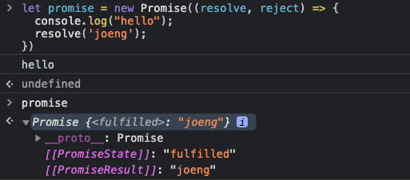
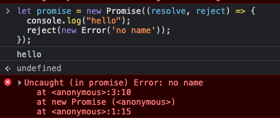
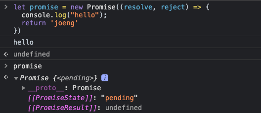
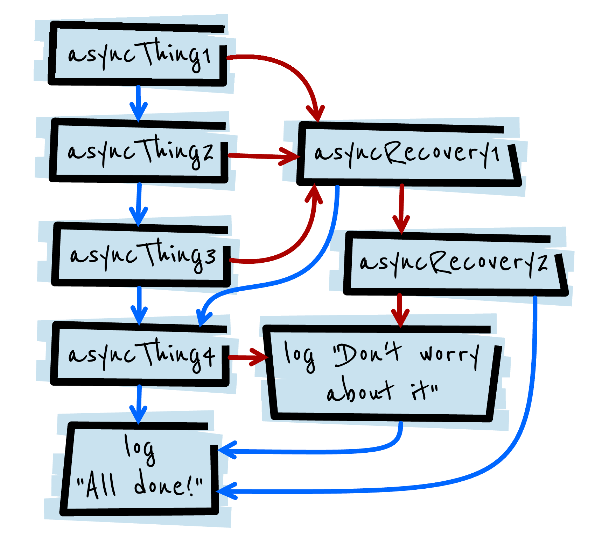

# promiese

비동기 작업을 실행하는 함수의 작업의 성공 또는 실패를 나타내어 주는 객체

- 현재 Event Loop에서 현재 실행중인 콜 스택이 완료된 후에 호출 됩니다.
- 비동기 작업이후 호출된 then()을 이용하여 추가한 콜백도 위와 동일합니다.
- then은 여러번 사용하여 콜백을 여러개 추가할 수 있다. 또한 각각의 콜백은 주어진 순서대로 실행된다.

## Promise state

작업 중인지, 성공 했는지, 실패 했는지

`pending`(대기)→ `fullfilled`(이행) or `rejected`(거부)

`promise`는 **`excute`라는 콜백함수**를 가지고 있고,

`excute`는 각각 `resolve, reject` 라는 콜백 함수를 인자로 받는다

`resolve`는 `fullfillled`일때 어떤 행동을하는 함수 ⇒ resolve 자체의 return은 void

`resolve(data)` → promise는 data를 가지고 있다.



`reject`는 `rejected`일때 어떤 행동을 할 것인지 정하는 함수 ⇒ reject 자체의 return은 void

`reject(new Error("error case"));` → 에러를 발생시켜서 에러를 핸들링 할 수 있게 만들어 줌 `catch` 를 이용하여 우리는 error를 핸들링 할 수 있다. `Error Object(Message, fileName, lineNumber)`



`excute`에서 resolve나 reject를 호출하지 않으면 영원히 pending상태



## producing vs consumer

1. Producer(정보를 제공하는 생산자)

```tsx
const promise = new Promise((resolve, reject) => {
	//doing work (network, fileload)
	console.log("Hello")
	somthingWorkfunc(() => {
		resolve('data')
	});
}); // Promise를 만드는 순간 excute 함수가 실행된다. (자동적으로)
```

 2. Consumer: then, catch, finally (이 정보를 사용하는 소비자)

```jsx
promise // chaining을 이용하여 연결한다. jeong
.then(value => { // resolve의 리턴을
	console.log(value); // jeong
})
.catch(e => { // reject이 일어날때
	console.log(error);
})
.finally(() => { // 성공하든 실패하든 상관 없이
	console.log('finally');
});
```

## chaining

순차적으로 이전 단계의 비동기 작업을 끝마치고 그 결과값을 이용하여 다음 비동기 작업을 실행해야하는 경우

`then()` 함수의 경우 새로운 promise를 반환한다.

```tsx
const promise = doSomething();
const promise2 = promise.then(successCallback, failureCallback);
```

or

```tsx
const promise2 = doSomething().then(successCallback, failureCallback);
```

반환값이 반드시 있어야 합니다, 만약 없다면 콜백 함수가 이전의 promise의 결과를 받지 못합니다.

```tsx
doSomething().then(function(result) {
  return doSomethingElse(result);
})
.then(function(newResult) {
  return doThirdThing(newResult);
})
.then(function(finalResult) {
  console.log('Got the final result: ' + finalResult);
})
.catch(failureCallback);
```

arrow func

```tsx
doSomething()
.then(result => doSomethingElse(result))
.then(newResult => doThirdThing(newResult))
.then(finalResult => {
  console.log(`Got the final result: ${finalResult}`);
})
.catch(failureCallback);
```

아래는 프로미스 체인에 대하여 어떤 로직으로 작동하는지 설명한 그림이다.

잘 확인해보고 `then` `catch`의 작동에 대하여 생각해보자.

```tsx
asyncThing1().then(function() {
  return asyncThing2();
}).then(function() {
  return asyncThing3();
}).catch(function(err) {
  return asyncRecovery1();
}).then(function() {
  return asyncThing4();
}, function(err) {
  return asyncRecovery2();
}).catch(function(err) {
  console.log("Don't worry about it");
}).then(function() {
  console.log("All done!");
})
```



mdn Error catch

```tsx
new Promise((resolve, reject) => {
    console.log('Initial');

    resolve();
})
.then(() => {
    throw new Error('Something failed'); // error를 발생시켜서 reject을 실행시킴

    console.log('Do this');
})
.catch(() => { // reject promise를 잡아 오는 catch
    console.log('Do that');
})
.then(() => {
    console.log('Do this, whatever happened before');
});

// Initial
// Do that
// Do this, whatever happened before
```

catch is just syntax sugar `then(undefined, func)`

```tsx
get('story.json').then(function(response) {
  console.log("Success!", response);
}).then(undefined, function(error) {
  console.log("Failed!", error);
})

===

get('story.json').then(function(response) {
  console.log("Success!", response);
}).catch(function(error) {
  console.log("Failed!", error);
})
```


참고

[youtude.com/ellie](https://www.youtube.com/watch?v=JB_yU6Oe2eE&t=1184s)

[mdn.com](https://developer.mozilla.org/ko/docs/Web/JavaScript/Reference/Global_Objects/Promise)

[webDEV](https://web.dev/promises/)