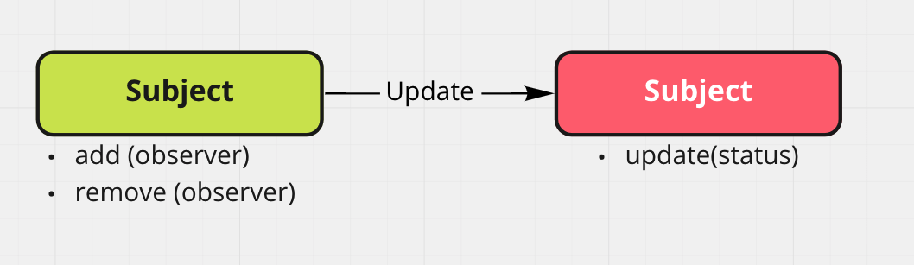
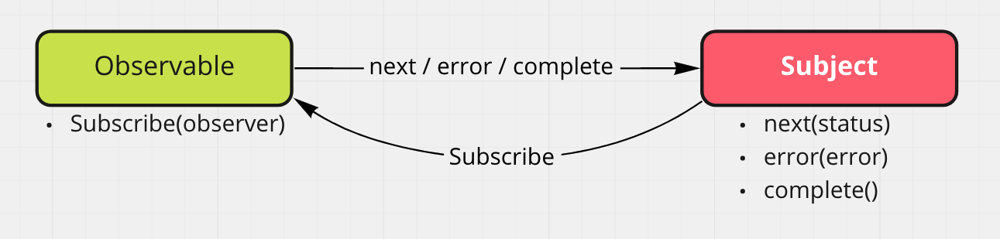

# rxjs

비동기 처리를 하기 위한 라이브러리 중 하나이다.

- Callback
- Promise
- Generator
- Async/Await

::: tip
비동기 처리 뿐 아니라 데이터의 상태를 전파하고 처리를 위한 라이브러리
:::

일관된 방식으로 안전하게 데이터 흐름을 처리하는 라이브러리이다.

Application은 크게는 입력 => 로직 => 결과로 나누어 볼 수 있다.

우리는 이러한 입력값을 처리해야한다.

입력값은 크게 두 가지로 나뉜다. 동기(sync) 비동기(async)

이런 입력값을 받는 방식은 js에서는 무수히 다양하다.


::: tip
**Rxjs는 이러한 다양한 방식을 일원화하여 처리할 수 있도록 돕는다.**
:::

이런 모든 Input을 `Observable`로 처리한다.


우리가 구성하는 어플리케이션은 대부분 상태를 다루른 함수들의 집합이다.

각각의 상태에 의존 관계를 가지고 각각을 처리하는 고민을 하는 과정이 개발자가 주로 고민하는 관점이 되겠다.

---

**여기서 등장하는 관점이 `Reactive Programing` 이다.**

데이터 흐름 상태 변화 전파에 중점을 둔 프로그램 패러다임, **데이터의 변화의 흐름이 자동으로 전파되는 것이 핵심이다.**


**Observer Pattern**



subject와 Observer 의 의존성이 줄어들어 쉽게 유지보수가 편리해진다.

Rxjs는 이러한 Observer Pattern을 적용할 수 있도록 돕는다.



**핵심 인터페이스**

- **Observable**

- **Operator**

- **Observer**

- **Subscription**

- Subject

- Schesuler

### Rxjs로 Oberver pattern 구현하기

1. 모든 데이터 소스를 Observable로 만든다.

2. Operatro를 사용하여 데이터를 변경, 추출 합침, 분리를 이룬다.

3. 원하는 데이터를 받아 처리하는 Observer를 만든다.

4. Observable의 subscribe를 통해 Observer를 등록한다.

5. Observable 구족을 정지하고 자원을 해지한다.


```ts
class rxjs {
  request<T>(gql: string, connectorUrl: string): Observable<AxiosResponse<T>> {
    this.vendorModel;
    return this.httpService.post<T>(connectorUrl, { query: gql }).pipe(
      map((axiosResponse: AxiosResponse) => {
        return axiosResponse.data;
      }),
    );
  }
}
```

Reactive Programming의 핵심인 Observables를 통해 배열과 같은 데티어 항목의 컬렉션을 사용하는 것과 같이 동일하고 단순하게 작업 비동기 이벤트 스트림을 처리할 수 있도록하여,

불필요한 콜백 루프를 피할 수 있고, 코드를 더욱 가독성 있게 만들어 준다.

이는 함수형 프로그래밍을 구현하기위한 클로저 패턴이나 순수함수 형태의 함수를 구성하기에 유리하게 코드를 구성 할 수 있도록 돕는다.


Observables에 대하여 알아보자 

### Observables

> 서로 의존하지 않는 여러잡업이 있을 때 다음 작업을 시작하기 전에 각 작업이 완료되기를 기다리는 대신 동시에 모든 작업을 시작할 수 있도록 함.

가장 긴 작업만큼 완료하는 데 시간이 걸림

Observables를 구독하고, 호출함으로써 모든 데이터의 흐름을 따라서 로직을 진행할 수 있다.