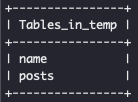
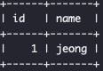
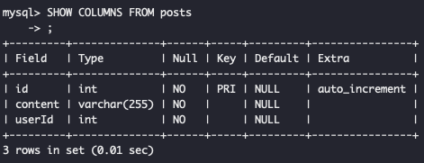

# node.js mySQL

node.js 환경에서도 mysql에 접근하여 직접 쿼리를 보내거나 데이터베이스를 다룰 수 있도록 도와주는 모듈을 지원한다.

```js
let mysql = require("mysql");

let con = mysql.createConnection({
  host: "localhost",
  user: "yourusername",
  password: "yourpassword",
  database: "mydb"
});

con.connect(function(err) {
  if (err) throw err;
  console.log("Connected!");
  // query문을 변수에 담아서 보낼 수 있다.
  let sql =
    "INSERT INTO customers (name, address) VALUES ('Company Inc', 'Highway 37')";
  // query요청을 보내는 api는 query()이다.
  // query(sql, callback(err, result, fields)) 으로 만들자.
  con.query(sql, function(err, result) {
    if (err) throw err;
    console.log("result : ", result);
  });
});
```

커넥션 종료히기

```js
connection.end(function(err) {
  // The connection is terminated now
});
```

연결된 소켓을 파괴한다.

```js
connection.destroy();
```

## 하나씩 사용해보자

초기 DB 상태

 

posts는 비어 있다.

코드를 작성해 보자

일단 mysql에 연결을 하자.

```js
const mysql = require("mysql");
const dotenv = require("dotenv");
dotenv.config();

const con = mysql.createConnection({
  host: "localhost",
  user: "root",
  // dotenv를 통해서 .env에 password를 저장해두고 사용하였다.
  password: process.env.DATABASE_PASSWORD,
  database: "temp"
});
```

이미 만들어져 테이블을 포함하여 데이터베이스의 스키마를 조금 구조화 해보자


user -> post -> comment

comment에 user를 태그할 수 있는 정도 서비스를 만든다고 가정하였다.

부족한 테이블을 만들고 FOREIGN KEY를 연결해보자.

```js
con.connect(function(err) {
  if (err) throw err;
  console.log("Connected!");
  // query문을 변수에 담아서 보낼 수 있다.
  // CREATE TABLE을 이용하자.
  let sql =
    "CREATE TABLE posts (id int PRIMARY AUTO_INCREMENT KEY NOT NULL, content varchar(255) NOT NULL, userId int NOT NULL)";
  // query요청을 보내는 api는 query()이다.
  // query(sql, callback(err, result, fields)) 으로 만들자.
  con.query(sql, function(err, result) {
    if (err) throw err;
    console.log("result : ", result);
  });
});
```



다른 테이블도 일단 만들어 두겠다.

이제 FOREIGN KEY를 등록해보자

```js
con.connect(function(err) {
  if (err) throw err;
  console.log("Connected!");
  // query문을 변수에 담아서 보낼 수 있다.
  // CREATE TABLE을 이용하자.
  let sql = `ALTER TABLE posts ADD FOREIGN KEY (userId) REFERENCES user (id)`;
  con.query(sql, function(err, result) {
    if (err) throw err;
    console.log("result : ", result);
  });
});
```

사실 이 작업은 mysql을 설치했다면.

sql 확장자 파일을 만들어서 `mysql -u root -p < schema.sql -D <target DB>` 커멘드를 이용하면 쉽게 할수 있다.

이제 대망의 데이터를 한번에 밀어 넣어 보자.

```js
con.connect(function(err) {
  if (err) throw err;
  console.log("Connected!");
  // query문을 변수에 담아서 보낼 수 있다.
  let sql = "INSERT INTO user (name) VALUES ?";
  // ? 에 들어갈 데이터를 배열에 담아서 쏙 넣어주자
  let user = [["dea"], [`han`], [`min`], ["kook"]];
  // query요청을 보내는 api는 query()이다.
  // query(sql, callback(err, result, fields)) 으로 만들자.
  con.query(sql, [user], function(err, result) {
    if (err) throw err;
    console.log("result : ", result);
  });
});
```


이와 같이 데이터를 순서대로 삽입해주는 기능을 가지고 있는데 공식 문서를 참고해서 사용하면 다양한 기능이 있는 것을 알수 있다.

요로코롬 2 번째 인자로 넣어 줬을때 자동으로 변환된단다.

```js
['a', 'b'] -> 'a', 'b'
[['a', 'b'], ['c', 'd']] -> ('a', 'b'), ('c', 'd')
'YYYY-mm-dd HH:ii:ss'
.toSqlString()
```

그러니까 이런게 가능하다는 것이다

```js
var post = { id: 1, title: "Hello MySQL" };
var query = connection.query("INSERT INTO posts SET ?", post, function(
  error,
  results,
  fields
) {
  if (error) throw error;
  // Neat!
});
```

또 하나의 유용하게 써먹을 기능을 알아보자면

```js
const con = mysql.createConnection({
  // 멀티라인을 true 로 만들어 주자.
  multipleStatements: true
});

connection.query("SELECT 1; SELECT 2", function(error, results, fields) {
  if (error) throw error;
  // `results` is an array with one element for every statement in the query:
  console.log(results[0]); // [{1: 1}]
  console.log(results[1]); // [{2: 2}]
});
```

이런게 된단다. 호옹 두 가지의 쿼리문을 동시에 실행해서 결과를 배열로 받을수도 있다

한 번 해보자

```js
const con = mysql.createConnection({
  // 멀티라인을 true 로 만들어 주자.
  multipleStatements: true
});

con.connect(function(err) {
  if (err) throw err;
  console.log("Connected!");
  // query문을 변수에 담아서 보낼 수 있다.
  let sql1 = "SELECT * FROM user; SELECT * FROM posts";
  // query요청을 보내는 api는 query()이다.
  con.query(sql1, function(err, results) {
    if (err) throw err;
    console.log("result : ", results[0], results[1]);
  });
});
```


