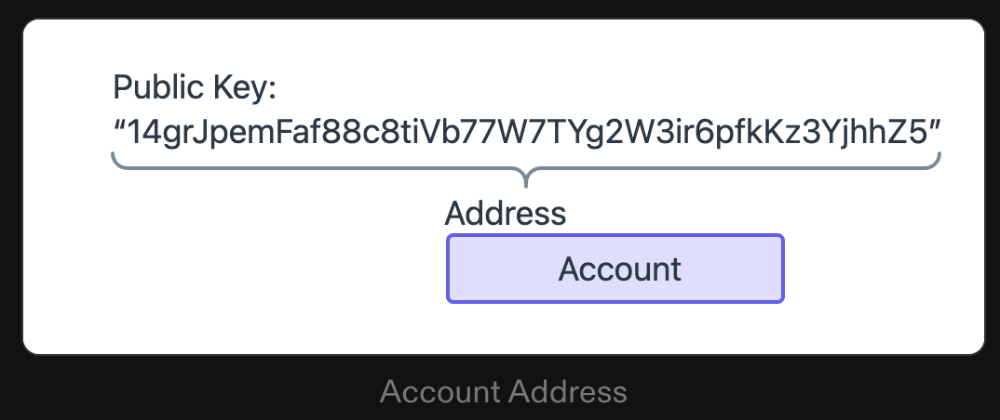
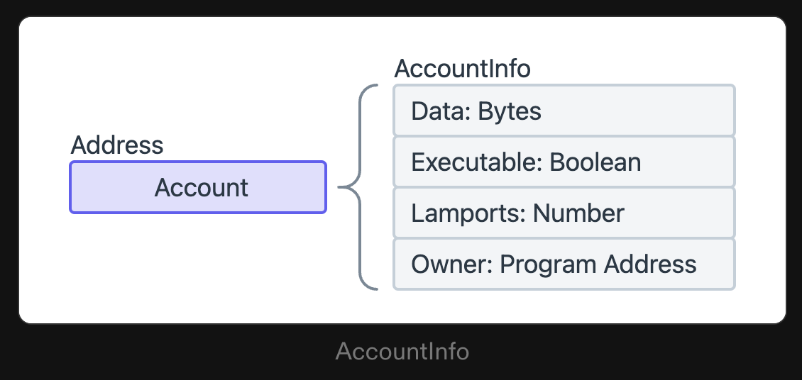
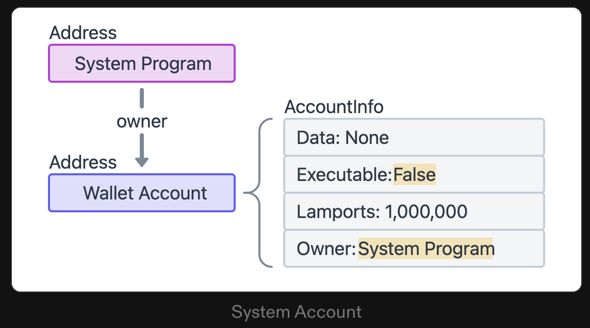
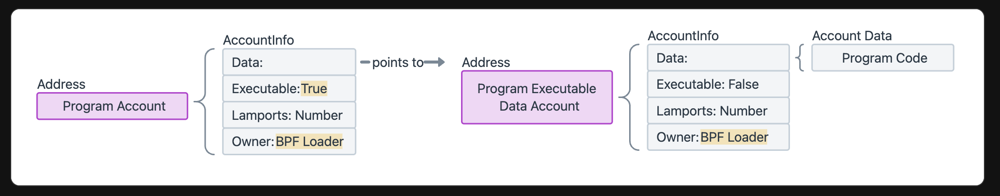
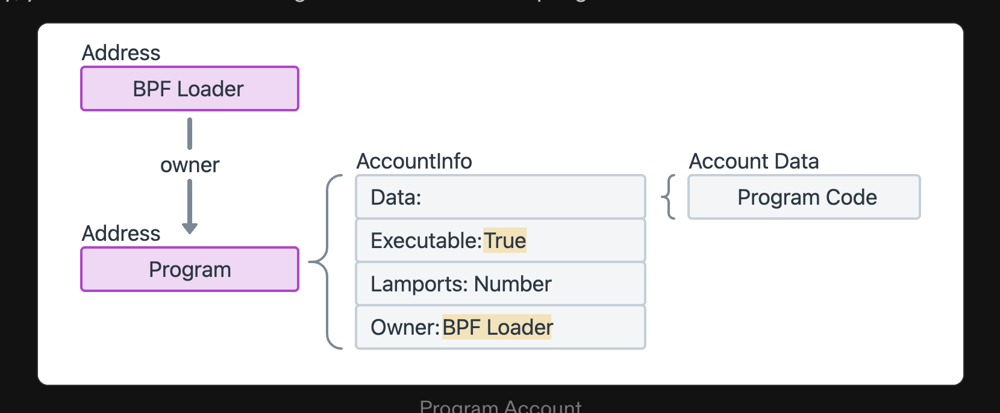
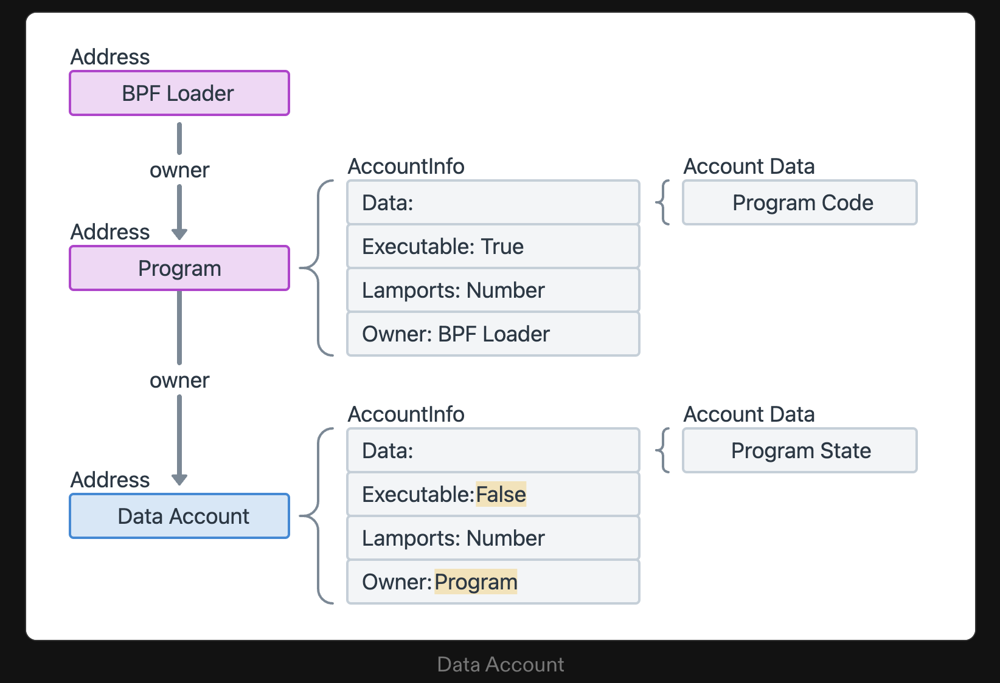

# Solana

SOL solana는 현대 가장 빠른 on-Chain Program 중의 하나이다.

이에 대한 스터디를 진행하면서 남기는 기록으로 다른이들에게 도움이 되었으면 좋겠다.

## Account

솔라나는 Account 라는 Key value와 같은 구조의 데이터 저장소의 모임으로 구성된다

모든 Account는 Owner를 가지고 있고 이 Owner만이 Account에 **데이터를 수정하거나 lamport 잔액을 공제**할 수 있다.

**하지만 누구나 잔액을 늘리는 것은 가능하다**

여기서 Key 값은 솔라나의 PublicKey 이다

- PublicKey는 Ed25519 형식의 32바이트로 표시된다



- Account의 최대 크기는 10MB 이다



아래는 rust anchor에 정의된 AccountInfo이다.

```rust
#[derive(Clone)]
#[repr(C)]
pub struct AccountInfo<'a> {
    /// Public key of the account
    pub key: &'a Pubkey,
    /// The lamports in the account.  Modifiable by programs.
    /// SOL의 가장 작은 단위인 램프(1 SOL = 10억 램프)로 계정 잔액을 숫자로 표현한 것입니다.
    /// 0.000000001 sol 값을 갖는 분수 네이티브 토큰.
    pub lamports: Rc<RefCell<&'a mut u64>>,
    /// The data held in this account.  Modifiable by programs.
    /// 계정의 상태를 저장하는 바이트 배열 계정이 프로그램(계약)인 경우 실행가능한 프로그랜 코드를 저장한다.
    /// 이 필드를 종종 Account data 라고 한다.
    pub data: Rc<RefCell<&'a mut [u8]>>,
    /// Program that owns this account
    /// 계정을 소유한 프로그램의 공개 키(프로그램 ID)를 지정합니다.
    pub owner: &'a Pubkey,
    /// The epoch at which this account will next owe rent
    pub rent_epoch: Epoch,
    /// Was the transaction signed by this account's public key?
    pub is_signer: bool,
    /// Is the account writable?
    pub is_writable: bool,
    /// This account's data contains a loaded program (and is now read-only)
    /// 계정이 프로그램인지 여부를 나타내는 부울 플래그입니다.
    pub executable: bool,
}
```

## Native Programs

솔라나의 노드중에 일부 필요한 기능을 구현하여 동작하는 Account Program들이 있다.

솔라나에서 맞춤형 프로그램을 개발할 때 일반적으로 **시스템 프로그램**과 **BPF 로더**라는 두 가지 기본 프로그램과 상호 작용하게 됩니다.

### [System Program](https://solana.com/ko/docs/core/accounts#system-program)

> By default, all new accounts are owned by the System Program

System Program의 역할

- 신규 계정 생성: 시스템 프로그램만이 신규 계정을 생성할 수 있습니다.

- 공간 할당: 각 계정의 데이터 필드에 대한 바이트 용량을 설정합니다.

- 프로그램 소유권 할당: 시스템 프로그램이 계정을 생성하면 지정된 프로그램 소유자를 다른 프로그램 계정에 재할당할 수 있습니다. 이는 Custom Program이 시스템 프로그램에서 생성한 새 계정의 소유권을 가져오는 방법입니다.

여기서 우리는 알 수 있다 Wallet은 Owner가 System Program이고 not Excutable인 형태면서 Lamports를 보유하고 있는 계정이 월렛인 것이다.

그림으로 보면 다음과 같다.



### [BPFLoader](https://solana.com/ko/docs/core/accounts#bpfloader-program)

BPF 로더는 네이티브 프로그램을 제외한 네트워크의 다른 모든 프로그램의 "소유자"로 지정된 프로그램입니다. 사용자 정의 프로그램의 배포, 업그레이드 및 실행을 담당합니다.

더 다양한 Native Program들이 있으니 참고하자

## Custom Program

솔라나에서는 “스마트 계약”을 프로그램이라고 부릅니다. 프로그램은 실행 가능한 코드를 포함하고 true로 설정된 "실행 가능" 플래그로 표시되는 계정입니다.

### Program Account

새로운 프로그램이 솔라나에 배포되면 기술적으로 세 개의 별도 계정이 생성된다

- **Program Account**: 온체인 프로그램을 대표하는 주 계정입니다. 이 계정은 실행 가능한 데이터 계정(컴파일된 프로그램 코드를 저장하는)의 주소와 프로그램에 대한 업데이트 권한(프로그램을 변경할 수 있는 주소)을 저장합니다.

- **Program Executable Data Account**: 프로그램 실행 가능 데이터 계정: 프로그램의 실행 가능 바이트 코드가 포함된 계정입니다.

- **Buffer Account**: 프로그램이 적극적으로 배포되거나 업그레이드되는 동안 바이트 코드를 저장하는 임시 계정입니다. 프로세스가 완료되면 데이터가 프로그램 실행 가능 데이터 계정으로 전송되고 버퍼 계정이 닫힙니다.



이를 단순히 추상화 하여 "프로그램 계정"을 프로그램 자체로 생각하면 됩니다.



### Data Account(PDA)

> 솔라나 프로그램은 "상태 비저장(`stateless`)"입니다. 즉, 프로그램 계정에는 프로그램의 실행 가능한 바이트 코드만 포함되어 있다는 의미입니다. 추가 데이터를 저장하고 수정하려면 새 계정을 만들어야 합니다. 이러한 계정을 일반적으로 "데이터 계정(`data accounts`)"이라고 합니다.

데이터 계정은 소유자 프로그램의 코드에 정의된 대로 임의의 데이터를 저장할 수 있습니다.



creating a data account for a custom program requires two steps:

- 시스템 프로그램을 호출하여 계정을 만든 다음 소유권을 사용자 정의 프로그램으로 이전합니다. => 시스템 프로그램만이 Account를 만들 수 있어서

- 이제 계정을 소유한 Custom Program을 호출하여 프로그램 코드에 정의된 대로 계정 데이터를 초기화합니다.

이를 총체적으로 이해할 필요는 없지만(이제는 추상화 되어서) 이해하고 있는것이 도움된다.
